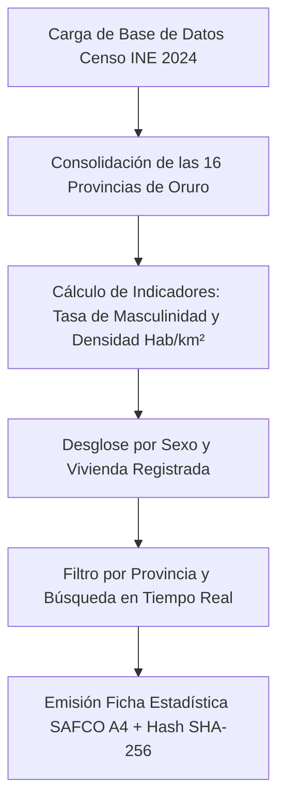

# 📊 Tablero Demográfico & Censo 2024 de Oruro

### **Gobernación Autónoma Departamental de Oruro (Bolivia)**
*Secretaría de Planificación del Desarrollo · Unidad de Estadística*


[](./index.html)
[](https://www.ine.gob.bo)
[](#-nota-de-confidencialidad-y-alcance-del-prototipo)

---

> [!IMPORTANT]
> ### 🔒 Nota de Confidencialidad y Alcance del Prototipo Tecnológico
> **Exactitud Operativa y Carácter Demostrativo:** Este módulo representa un **prototipo arquitectónico, modelo funcional e inducción de ingeniería de software** desarrollado para la Secretaría de Planificación del Desarrollo del Gobierno Autónomo Departamental de Oruro.
> 
> * **Réplica Exacta de los Datos Censales:** Los indicadores de las 16 provincias del departamento (570,194 habitantes, 185,420 viviendas, tasa de masculinidad del 98.4%) y la emisión de **Fichas Estadísticas SAFCO A4** reproducen la información oficial del Censo Nacional de Población y Vivienda 2024.
> * **Protección de Datos e Infraestructura Segura:** Este prototipo demuestra con total claridad la precisión técnica y modularidad del sistema.

---

## 🔄 Evolución del Sistema: ¿Para qué era suficiente antes vs. En qué mejora este proyecto?

### 📂 1. ¿Para qué era suficiente la metodología tradicional?
Antes de la implementación del Tablero Demográfico digital, los datos censales se consultaban en **libros impresos de publicaciones del INE**:
* **Suficiente para lectura de tablas estáticas:** Leer cifras agregadas por departamento.
* **Suficiente para archivo bibliográfico:** Consultar compendios estadísticos impresos cada 10 años.

### ⚡ 2. ¿En qué mejora sustancialmente este proyecto?
Este módulo dinamiza la toma de decisiones presupuestarias y territoriales:
1. **Desglose Dinámico de las 16 Provincias de Oruro**: Visualización interactiva de población total, hombres, mujeres, viviendas e índice de densidad poblacional.
2. **Cálculo de Tasa de Masculinidad en Tiempo Real**: Relación estadística entre la población masculina y femenina por provincia.
3. **Ficha Estadística Provincial A4 Membretada**: Emisión e impresión oficial de certificados A4 de datos censales con sello institucional y Hash SHA-256.
4. **Filtros e Indicadores por Densidad**: Clasificación automática (*Alta Densidad*, *Media Densidad*, *Baja Densidad*).
5. **Informe Ejecutivo Consolidad para Planificación (PTDI)**: Planilla consolidada A4 para la formulación del Plan Territorial de Desarrollo Integrado.

---

## 📐 Flujo de Análisis Demográfico & Censo 2024



---

## 📍 Matriz Demográfica de las 16 Provincias de Oruro (Censo 2024)

| Provincia | Capital | Población (Hab.) | Viviendas | Densidad Poblacional |
|---|---|---|---|---|
| **Cercado** | Oruro | **310,000** | 95,000 | Alta (54.5 Hab/km²) |
| **Eduardo Abaroa** | Challapata | **33,200** | 11,200 | Media (8.8 Hab/km²) |
| **Pantaleón Dalence** | Huanuni | **29,400** | 9,800 | Alta (30.6 Hab/km²) |
| **Poopó** | Poopó | **16,800** | 5,600 | Media (8.4 Hab/km²) |
| **Ladislao Cabrera** | Salinas de Garci Mendoza | **14,800** | 5,100 | Baja (1.7 Hab/km²) |
| **Sebastián Pagador** | Santiago de Huari | **13,894** | 4,800 | Media (7.2 Hab/km²) |
| **Carangas** | Corque | **13,500** | 4,900 | Baja (2.7 Hab/km²) |
| **Sabaya** | Sabaya | **11,400** | 3,900 | Baja (1.3 Hab/km²) |
| **Saucarí** | Toledo | **10,800** | 3,700 | Baja (6.5 Hab/km²) |
| **Litoral** | Huachacalla | **10,400** | 3,500 | Baja (3.6 Hab/km²) |
| **Sajama** | Curahuara de Carangas | **10,200** | 3,400 | Baja (1.8 Hab/km²) |
| **Sud Carangas** | Andamarca | **7,200** | 2,600 | Baja (2.0 Hab/km²) |
| **Nor Carangas** | Huayllamarca | **5,600** | 2,100 | Baja (6.4 Hab/km²) |
| **San Pedro de Totora** | Totora | **5,500** | 2,000 | Baja (3.8 Hab/km²) |
| **Tomas Barrón** | Eucaliptus | **5,400** | 1,900 | Media (15.1 Hab/km²) |
| **Puerto de Mejillones** | La Rivera | **2,100** | 920 | Baja (2.7 Hab/km²) |

---

## 🧪 Guía de Pruebas de QA e Inducción Paso a Paso

1. **Caso 1: Consulta Demográfica de la Provincia Cercado**
   * En el buscador de la tabla, escribe `Cercado`.
   * *Resultado:* Filtrará instantáneamente mostrando `310,000 Hab.` y `95,000 Viv.`. Haz clic en **Ficha A4** para previsualizar la certificación oficial.

2. **Caso 2: Impresión de Informe Ejecutivo Demográfico A4**
   * En la barra lateral, haz clic en **Informe Ejecutivo A4**.
   * *Resultado:* Renderizará la planilla A4 consolidada de las 16 provincias.

---

## 📂 Arquitectura del Módulo

```text
Panel-de-control/
├── index.html                   # Dashboard demográfico, tabla de provincias y modales A4
├── readme.md                    # Documentación técnica, datos Censo 2024, tabla 16 provincias y guía QA
├── assets/
│   ├── banner.png               # Banner panorámico oficial (1000 x 300 px)
│   └── css/
│       └── styles.css           # Design Tokens (Titanium Cyan), tablas y estilos de impresión A4
└── src/
    └── main.js                  # Lógica de datos censales, calculadoras de ratio y reportes
```

---

*Gobierno Autónomo Departamental de Oruro — Secretaría de Planificación del Desarrollo*