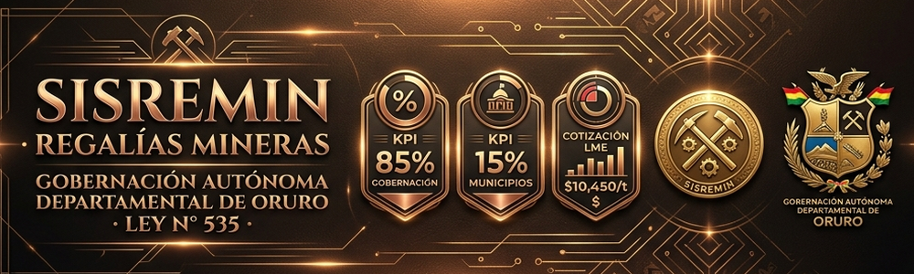
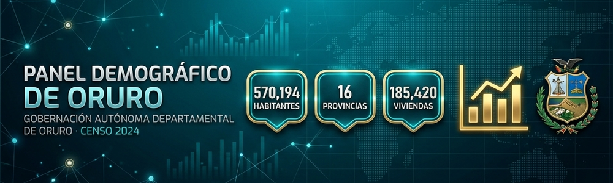
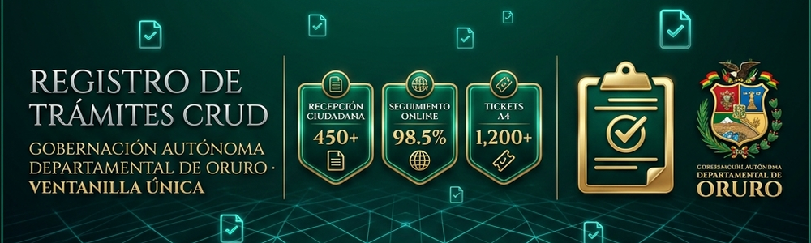
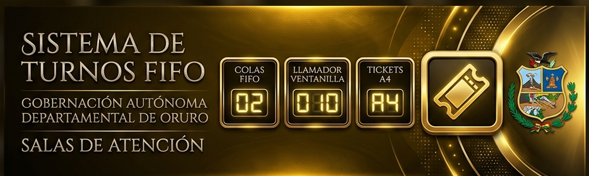
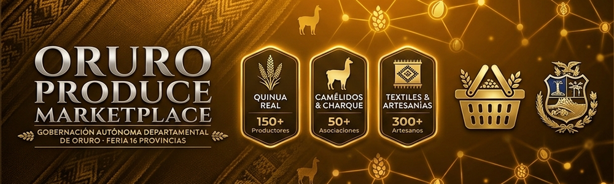
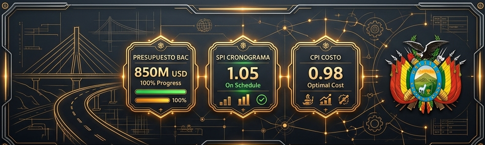
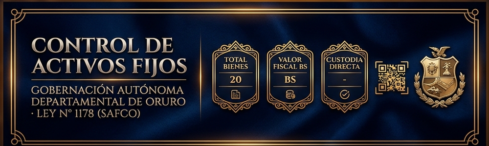
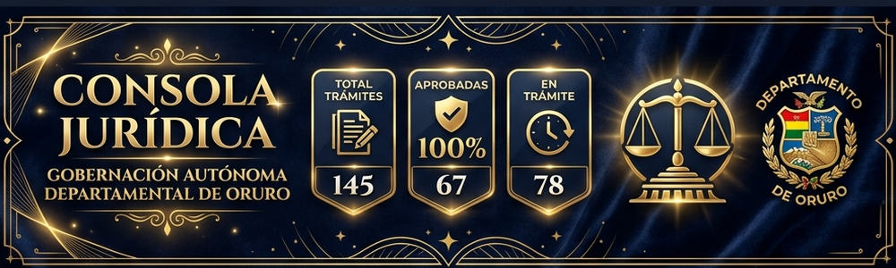
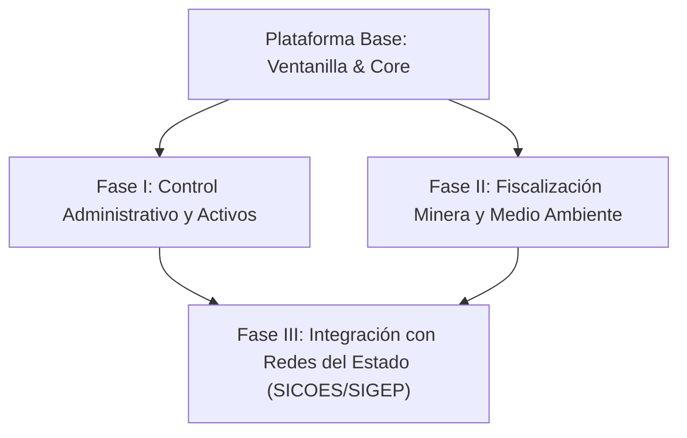

# 🏛️ Portafolio de Consultoría Tecnológica
### Gobernación Autónoma Departamental de Oruro (Bolivia)


  

---

Este repositorio reúne una suite de soluciones tecnológicas, paneles de control y módulos de gestión pública diseñados y desarrollados durante mi gestión como **Consultor Privado de Software** para la **Gobernación Autónoma Departamental de Oruro** (Bolivia). 

Los proyectos abordan problemáticas reales de la administración pública local, abarcando desde el control de flujo de trámites ciudadanos y la trazabilidad de correspondencia oficial, hasta la liquidación automatizada de regalías mineras conforme a la normativa boliviana vigente.

> [!IMPORTANT]
> **Carácter Demostrativo e Inductivo:** Los proyectos de este repositorio constituyen **bases técnicas, prototipos y maquetas funcionales** que modelan los requisitos y la lógica de negocio de los sistemas definitivos. 
> 
> **Seguridad y Confidencialidad de la Información:** Al trabajar en un entorno gubernamental como la Gobernación Autónoma Departamental de Oruro, los sistemas de producción reales están sujetos a rigurosos controles de calidad, auditorías gubernamentales y manejo de **información confidencial y privilegiada**. Por motivos de seguridad y cumplimiento normativo, los sistemas definitivos operan bajo infraestructura aislada y segura. Este repositorio tiene un propósito puramente arquitectónico, de inducción técnica y demostrativo de capacidades, sin exponer bases de datos reales ni código de producción sensible.

---

## 📂 Resumen de Proyectos y Sistemas Implementados

El ecosistema de desarrollo consta de **7 proyectos modulares**, estructurados de forma pedagógica y técnica según diversas fases de complejidad en ingeniería de software:

| # | Proyecto / Módulo | Nivel / Fase | Descripción Principal | Tecnologías Clave |
|---|---|---|---|---|
| 1 | **[SISREMIN - Regalías Mineras](./liquidacion-regalias)** | Fase 5 (Avanzado - Ley 535) | Liquidación metalúrgica y tributaria de la Dirección de Minería bajo la Ley N° 535, alícuotas, Boleta A4 y Firma SHA-256. | Fórmulas Ley Fina, Cotizaciones LME, Distribución 85/15, Boleta A4, Firma Hash SHA-256. |
| 2 | **[SISCO - Hojas de Ruta](./sistema-correspondencia)** | Fase 4 (Avanzado - SAFCO) | Radicación en Ventanilla Única, derivación entre secretarías, timeline de proveídos, Hoja A4 y Firma SHA-256. | Radicación Ventanilla Única, Timeline Derivación, Hoja de Ruta SAFCO A4, Rastreo Ciudadano. |
| 3 | **[Panel de Control Demográfico](./Panel-de-control)** | Fase 3 (Intermedio) | Dashboard estadístico interactivo para el análisis poblacional y toma de decisiones gubernamentales. | Programación funcional avanzada (`.reduce()`), Localización numérica (`.toLocaleString()`). |
| 4 | **[Registro de Trámites CRUD](./registro-tramites)** | Fase 2 (SAFCO - CRUD) | Registro, seguimiento en tiempo real, operaciones CRUD, Ticket de Recepción A4 y Firma SHA-256. | Operaciones CRUD, Ticket Recepción A4, LocalStorage, Búsqueda Filtros. |
| 5 | **[Sistema de Turnos FIFO](./sistema-turnos)** | Fase 1 (SAFCO - Turnos) | Gestión de colas FIFO, llamador de ventanillas, Ticket de Atención A4 y Firma SHA-256. | Algoritmo Cola FIFO, Llamador Ventanillas, Ticket Atención A4, Firma Hash SHA-256. |
| 6 | **[Monitor del Dólar](./monitor-dolar)** | Herramienta Auxiliar | Dashboard de visualización del tipo de cambio e histórico del dólar en tiempo real. | ES6 Modules, Fetch API asíncrona, Control y actualización del DOM. |
| 7 | **[Licencias Ambientales](./licencias-ambientales)** | Fase 7 (Avanzado - Ley 1333) | Fiscalización territorial, mapa SVG interactivo de provincias, categorización Ley N° 1333 y emisión de D.I.A. A4. | Mapa SVG Interactivo, Risk Score (1-11 Pts), Declaratoria D.I.A. A4, Firma Digital SHA-256. |
| 8 | **[Consola Jurídica - Personerías](./control-personerias)** | Fase 6 (Avanzado - Ley 031) | Registro, validación documental 4/4 y emisión de Resoluciones A4 con borrador en vivo y Firma SHA-256. | Live Drafting, Visual Micro-Chips, Impresión A4, Firma Criptográfica SHA-256, LocalStorage. |
| 9 | **[Control de Activos Fijos](./control-activos)** | Fase 8 (Avanzado - Ley 1178) | Inventario patrimonial SAFCO, asignación a custodios, etiquetas autoadhesivas QR, Acta A4 y Firma SHA-256. | Generador QR, Acta de Entrega A4, Trazabilidad Custodia, Analítica Patrimonial, LocalStorage. |
| 10 | **[Monitoreo de Obras Viales (EVM)](./seguimiento-obras)** | Fase 9 (Avanzado - EVM) | Fiscalización de obras públicas SEDECA con metodología Earned Value (SPI, CPI, EAC), Certificados A4 y Firma SHA-256. | Fórmulas EVM, Simulador de Desviaciones, Certificado A4 SEDECA, Firma Hash SHA-256. |
| 11 | **[Control de Combustible](./control-combustible)** | Fase 10 (Avanzado - B-SISA) | Control de carburantes, tanques 3D de depósitos centrales, vales B-SISA A4 y Firma SHA-256. | Depósitos 3D Animados, Precios Subvencionados, Vales B-SISA A4, Firma Hash SHA-256. |
| 12 | **[Oruro Produce Marketplace](./oruro-marketplace-app)** | Fase 11 (Feria 16 Provincias) | Catálogo de productores de las 16 provincias, quinua real, camélidos, Ficha A4 SAFCO y Firma SHA-256. | Catálogo 16 Provincias, Ficha A4 Productor, Filtros Origen, Firma Hash SHA-256. |

---

## 🛠️ Detalles de los Módulos de Software

### 1. 🪙 SISREMIN — Liquidación de Regalías Mineras (`liquidacion-regalias`)
Módulo desarrollado para la **Dirección de Minería y Metalurgia** de la Gobernación de Oruro para la administración, liquidación metalúrgica y recaudación de regalías mineras bajo la Ley N° 535:



*   **Calculadora Metalúrgica en Tiempo Real**: Determinación de Peso Seco (Kg), Peso Fino (Kg), Valor Bruto de Venta (Bs.) y alícuotas según mineral (Estaño 5%, Plata 6%, Zinc 5%, Plomo 5%, Oro 7%).
*   **Distribución Autonómica (Ley N° 535)**: División automática de recaudación entre el **85% para la Gobernación de Oruro** (obras de infraestructura) y el **15% para el Municipio Productor** de origen.
*   **Boleta de Pre-Liquidación A4 Membretada**: Emisión de certificados A4 oficiales con visto técnico del Banco Unión, desglose tributario y Hash SHA-256.
*   **Informe Ejecutivo A4**: Consolidado de recaudación minera para auditoría de recursos naturales.

### 2. 🏛️ SISCO — Hojas de Ruta & Correspondencia (`sistema-correspondencia`)
Módulo desarrollado para la **Secretaría General** y **Ventanilla Única** de la Gobernación de Oruro para la radicación, distribución interinstitucional y seguimiento de Hojas de Ruta bajo la Ley N° 1178 (SAFCO):


*   **Ventanilla Única de Radicación**: Registro instantáneo de solicitudes ciudadanas con código único `HR-2026-XXXX` y asignación de prioridad operativa.
*   **Timeline de Derivación & Proveídos**: Historial dinámico que audita el tránsito de documentos entre secretarías con observaciones formales.
*   **Hoja de Ruta A4 Membretada SAFCO**: Emisión e impresión oficial del documento de Hoja de Ruta A4 con matriz de proveídos para firmas y sellos.
*   **Rastreo Ciudadano de Trámites**: Herramienta de consulta pública en tiempo real para usuarios.

### 3. 📊 Tablero Demográfico & Censo 2024 (`Panel-de-control`)
Módulo desarrollado para la **Secretaría de Planificación del Desarrollo** y la **Unidad de Estadística** de la Gobernación de Oruro para el análisis demográfico y presupuestario del Censo 2024:



*   **Desglose de las 16 Provincias**: Población total (570,194 Hab.), viviendas (185,420 Viv.) e índice de densidad poblacional.
*   **Tasa de Masculinidad en Tiempo Real**: Indicadores estadísticos por provincia.
*   **Ficha Estadística Provincial A4**: Emisión e impresión oficial de certificados A4 censales con Hash SHA-256.

### 4. 📋 Registro de Trámites Ciudadanos (`registro-tramites`)
Módulo desarrollado para la **Ventanilla Única de Atención al Ciudadano** de la Gobernación de Oruro para la gestión CRUD y entrega de comprobantes de trámites públicos:



*   **Gestión CRUD Completa**: Creación, actualización de estados (*Pendiente*, *En Proceso*, *Aprobado*), eliminación y filtrado de trámites.
*   **Ticket Oficial de Recepción A4**: Emisión e impresión oficial de comprobantes A4 con código de seguimiento `TR-2026-XXXX`, visto SAFCO y Hash SHA-256.

### 5. 🎟️ Sistema de Turnos FIFO & Ventanillas (`sistema-turnos`)
Módulo desarrollado para las **Salas de Atención al Ciudadano** de la Gobernación de Oruro para la distribución equitativa de turnos y llamado digital a ventanillas:



*   **Algoritmo de Colas FIFO en Memoria**: Gestión secuencial equitativa (`.shift()` / `.push()`).
*   **Llamador Digital en Pantalla Gigante**: Notificación visual y sonora de llamado a ventanillas (Ventanilla 1, 2 y 3).
*   **Ticket de Atención A4 Membretado**: Emisión de tickets A4 con número de turno `T-XXX`, área de atención y Hash SHA-256.

### 6. 🌾 Oruro Produce Marketplace (`oruro-marketplace-app`)
Módulo desarrollado para la **Secretaría Departamental de Desarrollo Productivo** de la Gobernación de Oruro para la feria virtual y comercialización de productos de las 16 provincias:



*   **Catálogo de las 16 Provincias**: Quinua Real orgánica de Salinas, charque de llama de Challapata, textiles de alpaca de Curahuara de Carangas y artesanías mineras.
*   **Certificado A4 de Productor SAFCO**: Emisión e impresión oficial de fichas A4 de acreditación de origen con vistos legales y Hash SHA-256.

### 7. ⛽ Control de Combustible & Depósitos B-SISA (`control-combustible`)
Módulo desarrollado para la **Tesorería Departamental** y el **Control de Surtidores** de la Gobernación de Oruro para la administración y fiscalización de carburantes bajo la normativa de la Agencia Nacional de Hidrocarburos (ANH) y B-SISA:


*   **Tanques de Depósito 3D Animados**: Control visual en tiempo real de volumen disponible en los depósitos centrales de Gasolina Especial (Bs. 3.74/Lt) y Diésel Oíl (Bs. 3.72/Lt).
*   **Vale Oficial de Despacho B-SISA A4 Membretado**: Emisión e impresión de vales A4 con registro B-SISA, firma del chofer, firma del encargado de surtidor y Hash SHA-256.
*   **Reabastecimiento de Tanques**: Herramienta interactiva para registrar el ingreso de camiones cisterna.
*   **Informe Ejecutivo de Consumo SAFCO**: Consolidado de consumo por unidad ejecutora para auditoría financiera.

### 7. 🚧 Monitoreo de Obras Viales EVM (`seguimiento-obras`)
Módulo desarrollado para la **Secretaría Departamental de Obras Públicas** y el **SEDECA** de la Gobernación de Oruro para la fiscalización financiera y avance físico mediante la metodología de Valor Ganado (*Earned Value Management - ANSI/EIA 748*):



*   **Fórmulas EVM Automatizadas**: Cálculo instantáneo de `SPI` (Índice de Cronograma), `CPI` (Índice de Costo) y `EAC` (Estimación de Costo al Finalizar).
*   **Certificado de Auditoría Vial A4 Membretado**: Emisión oficial de informes A4 con vistos técnicos, sellos del SEDECA, firmas de Fiscalización y Hash SHA-256.
*   **Simulador de Desviación de Proyectos**: Herramienta interactiva para proyectar variaciones presupuestarias y reprogramación de obras públicas.
*   **Línea de Tiempo de Hitos**: Historial de licitación, orden de proceder e inspecciones físicas.

### 8. 📦 Control de Activos Fijos (`control-activos`)
Módulo desarrollado para la **Unidad de Bienes y Servicios** de la Gobernación de Oruro para el inventario, control patrimonial e imposición de responsabilidad a custodios bajo la Ley N° 1178 (SAFCO):



*   **Acta de Asignación y Entrega A4 Membretada**: Generación e impresión oficial de Actas A4 con visto, valor fiscal en Bolivianos (Bs.), firma del custodio y código Hash de 256 bits.
*   **Generador & Escáner de Etiquetas Autoadhesivas QR**: Herramienta integrada para generar e imprimir pegatinas QR autoadhesivas de activos fijos.
*   **Trazabilidad & Historial de Custodia**: Timeline interactivo que registra altas, reasignaciones de oficina y mantenimientos técnicos.
*   **Analítica Patrimonial**: Consolidado dinámico de valor fiscal e inventario físico clasificado por categoría SAFCO.

### 9. 🌿 Licencias Ambientales & Mapa de Riesgo (`licencias-ambientales`)
Módulo desarrollado para la **Secretaría Departamental de Medio Ambiente y Agua** del Gobierno Autónomo Departamental de Oruro para la evaluación y fiscalización ambiental bajo la Ley N° 1333 de Medio Ambiente:


*   **Mapa SVG Interactivo de Riesgo Territorial**: Mapa vectorial interactivo de las 16 provincias del Departamento de Oruro con código de colores según nivel de impacto ambiental (*Riesgo Bajo 1-3 Pts*, *Medio 4-6 Pts*, *Alto 7-11 Pts*).
*   **Calculadora Ley N° 1333 (Categorías I, II, III, IV)**: Matriz de evaluación en tiempo real basada en vulnerabilidad a fuentes de agua, centros poblados y áreas protegidas.
*   **Declaratoria de Impacto Ambiental (D.I.A.) A4 Membretada**: Emisión e impresión oficial de certificados A4 con sello institucional, visto, considerandos y firma de la AACD.
*   **Trazabilidad & Verificador Criptográfico SHA-256**: Herramienta de auditoría para verificar autenticidad de licencias con Hash de 256 bits y código QR.

### 10. 📜 Consola Jurídica — Personerías Jurídicas (`control-personerias`)
Módulo desarrollado para la **Dirección General de Asuntos Jurídicos** de la Gobernación de Oruro para la fiscalización y emisión de Resoluciones Administrativas bajo la Ley N° 031 Marco de Autonomías:



*   **Exactitud Operativa e Inducción Técnica**: Réplica exacta del proceso legal de aprobación de organizaciones civiles, juntas vecinales (OTBs), comunidades originarias y sindicatos agrarios de las 16 provincias de Oruro.
*   **Borrador en Vivo (*Live Drafting*)**: Formulario con panel dividido que genera y actualiza en tiempo real la resolución membretada a medida que el usuario ingresa datos.
*   **Checklist Documental 4/4**: Verificación dinámica de Acta de Fundación, Estatuto, Reglamento Interno y Acta de Posesión del Directorio con micro-chips interactivos.
*   **Firma Digital SHA-256 y Sello de Agua**: Emisión de documentos membretados A4 con sello institucional dorado, verificación QR y código Hash de auditoría.

### 2. 🪙 SISREMIN - Liquidación de Regalías Mineras (`liquidacion-regalias`)
Módulo desarrollado para la **Dirección de Minería y Metalurgia** de la Gobernación de Oruro. Permite digitalizar y certificar las liquidaciones tributarias por explotación de minerales:
*   **Fórmulas Metalúrgicas**: Peso Seco y Ley de Concentración Fina en función del mineral (estaño, zinc, plata, plomo, etc.) utilizando valores de la Bolsa de Metales de Londres (LME).
    *   `Peso Seco = Peso Húmedo * (1 - Humedad / 100)`
    *   `Peso Fino = Peso Seco * (Ley / 100)`
*   **Marco de Distribución (Ley N° 535)**:
    *   **85%** va directamente a la Gobernación Autónoma Departamental de Oruro para obras viales e infraestructura.
    *   **15%** va para el Municipio Productor de donde se extrajo el recurso natural.
*   **Boleta de Pre-Liquidación**: Diseño con fondos translúcidos y desenfoque Gaussiano, y soporte de hojas de estilo exclusivas de impresión física (`@media print`) para generar una boleta nítida de pre-liquidación oficial (estilo Banco Unión) en formato A5/Carta a blanco y negro.

### 3. 🏛️ Seguimiento de Hojas de Ruta (`sistema-correspondencia`)
Desarrollado para resolver la trazabilidad de documentos en la burocracia pública mediante un flujo de correspondencia departamental.
*   **Proveídos y Derivaciones**: Permite a cada secretaría derivar el documento a otra oficina ingresando el nuevo estado y el proveído (comentario oficial).
*   **Línea de Tiempo Dinámica**: Renderizado dinámico tipo vertical timeline que rastrea e ilustra cada paso del expediente desde Ventanilla Única, destacando el estado activo y los completados.

### 📊 4. Dashboard Estadístico Departamental (`Panel-de-control`)
Panel visual premium orientado a la toma de decisiones por los directores y secretarios de la Gobernación.
*   **Big Data Local**: Filtra y acumula miles de registros en memoria usando programación funcional avanzada (`.reduce()`, `.filter()`).
*   **Formatos Oficiales**: Renderiza e internacionaliza montos y cantidades usando el estándar oficial de localización de JavaScript `.toLocaleString()`, garantizando legibilidad en Bolivia.

### 📝 5. Gestor de Trámites Ciudadanos (`registro-tramites`)
Un CRUD simplificado con persistencia local permanente para registrar solicitudes ciudadanas en Ventanilla Única sin necesidad de bases de datos centralizadas en la primera fase.
*   **Persistencia**: Sincronización transparente con `LocalStorage`.
*   **UI/UX**: Control de estado vacío (cuando no hay trámites en bandeja, la interfaz muestra un mensaje institucional).

### 🚶 6. Sistema de Gestión de Turnos (`sistema-turnos`)
Mapea el flujo de atención al ciudadano en las oficinas centrales de la Gobernación de Oruro.
*   **Algoritmo**: Estructura de Cola secuencial clásica (First-In, First-Out).
*   **Diseño**: Panel de visualización de turnos para salas de espera e interfaz de control para los operarios de ventanilla.

### 💵 7. Monitor del Dólar en Tiempo Real (`monitor-dolar`)
Un panel auxiliar que permite monitorear cotizaciones de monedas extranjeras para estimaciones presupuestarias en licitaciones internacionales.
*   **Asincronía**: Implementación nativa de la Fetch API para llamadas no bloqueantes.
*   **Modularidad**: Código highly reutilizable estructurado bajo ES6 Modules (`import`/`export`).

### 🌾 8. Plataforma de Fomento Comercial - MarketOruro (`oruro-marketplace-app`)
Portal oficial del **Gobierno Autónomo Departamental de Oruro** diseñado para incentivar el comercio solidario y directo de productores agrícolas, camélidos y artesanos del altiplano, eliminando la intermediación comercial.
*   **Autenticación e Inicio de Sesión**: Integración real con el SDK oficial de **Firebase v10.8.0** para registro de productores locales con correo/contraseña y acceso simplificado mediante **Google Sign-In (Popups)**, con fallback transparente a almacenamiento local persistente en caso de caída de red.
*   **Onboarding Obligatorio de Productores**: Intercepta de manera segura los accesos de nuevos productores para obligarles a registrar su Municipio de origen en el departamento de Oruro y su número de WhatsApp antes de publicar.
*   **Diseño Móvil Premium (Estilo Facebook Marketplace)**:
    *   **Grilla Responsiva 2-Columnas**: Muestra los productos en dos columnas compactas en pantallas móviles para un escaneo visual de alta densidad.
    *   **Carrusel de Categorías Táctil**: Swipe horizontal nativo en celular para alternar entre categorías.
    *   **Drawer de Navegación Móvil (Botón Hamburguesa)**: Oculta el menú pesado de escritorio bajo un botón `☰` que despliega un drawer translúcido deslizable.
    *   **Barra de Navegación Inferior Fija (Bottom Tab Bar)**: Acceso directo táctil con efecto blur a Inicio, Catálogo, Publicar (botón central flotante), Mis Ventas y Soporte Técnico.
*   **Moderación Institucional**: Consola administrativa protegida por roles (solo accesible para el correo institucional `admin@oruro.gob.bo`) para que los moderadores de la Gobernación supervisen, aprueben o suspendan ofertas comerciales.
*   **Canales Directos**: Conexión de un solo toque para iniciar chats por WhatsApp con plantillas dinámicas autocompletadas de negociación, o llamadas telefónicas directas al celular del productor.

---

## ⚡ Requisitos e Instrucciones de Ejecución

Debido a que varias de las aplicaciones utilizan JavaScript modular (ES6 Modules) y APIs del navegador con restricciones de seguridad CORS, es necesario servir los proyectos desde un servidor local.

### Opción 1: Python (Recomendada en Linux/macOS)
Abre la terminal en la carpeta raíz del proyecto seleccionado y ejecuta:
```bash
python3 -m http.server 8000
```
Luego ingresa a `http://localhost:8000` en tu navegador.

### Opción 2: VS Code Live Server
Si utilizas Visual Studio Code:
1. Instala la extensión **Live Server**.
2. Haz clic derecho sobre el archivo `index.html` del proyecto deseado y selecciona **"Open with Live Server"**.

---

## 🎯 Impacto y Objetivos del Portafolio
Este conjunto de proyectos refleja la capacidad de resolver retos de ingeniería de software aplicados a la administración pública:
*   **Optimización del Tiempo**: La digitalización de la correspondencia y de turnos reduce los tiempos de espera y tramitación ciudadana.
*   **Seguridad Fiscal**: El cálculo exacto y boletas estandarizadas de regalías mineras protegen la recaudación departamental.
*   **Decisiones Basadas en Datos**: El Dashboard demográfico permite una mejor asignación de presupuestos provinciales.
*   **Código Limpio e Institucional**: Estilos visuales consistentes con la identidad de la Gobernación de Oruro, priorizando usabilidad, velocidad de carga y accesibilidad.

---

## 🚀 Planificación de Ingeniería y Próximos Módulos (Arquitectura Senior - +20 años de experiencia)

Con el fin de consolidar un **Gobierno Digital Integrado y Seguro** para el departamento de Oruro, se ha estructurado una planificación estratégica orientada al desarrollo de futuras extensiones. Esta planificación ha sido diseñada bajo estándares de arquitectura corporativa de misión crítica:



### 📋 Módulos Planificados en el Roadmap Tecnológico

#### 1. 📂 Gestión de Personerías Jurídicas (`control-personerias`)
*   **Propósito**: Digitalizar el ciclo de vida del trámite para el reconocimiento de Personerías Jurídicas de comunidades indígenas, OTBs y sindicatos agrarios en el departamento.
*   **Criterio de Ingeniería**: Implementación de un gestor documental con firma digital y verificación de requisitos legales mínimos, automatizando la generación de la Resolución Departamental.

#### 🍃 2. Monitoreo e Impacto de Licencias Ambientales (`licencias-ambientales`)
*   **Propósito**: Seguimiento y fiscalización de Fichas Ambientales (FA) y Manifiestos Ambientales (MA) de operadoras industriales y cooperativas mineras.
*   **Criterio de Ingeniería**: Integración con un módulo de mapas (SIG/GIS) para georreferenciar zonas con pasivos ambientales activos e impactos hídricos en cuencas vulnerables (ej. Lago Poopó).

#### 🖥️ 3. Auditoría de Activos Fijos mediante Código QR (`control-activos`)
*   **Propósito**: Control físico y contable del equipamiento y parque automotor asignado a los servidores públicos del Gobierno Autónomo.
*   **Criterio de Ingeniería**: Sistema descentralizado que genera y valida firmas hash contenidas en códigos QR dinámicos para inventarios rápidos sin conexión a internet.

#### 🚧 4. Control de Inversión Pública y Mantenimiento Vial (`seguimiento-obras`)
*   **Propósito**: Seguimiento físico y presupuestario del mantenimiento vial llevado a cabo por el Servicio Departamental de Caminos (SEDECA).
*   **Criterio de Ingeniería**: Modelado bajo metodologías de Valor Ganado (EVM) para medir la desviación presupuestaria respecto al avance de obras reportado desde las provincias.

#### ⛽ 5. Fiscalización de Combustible y Flota Oficial (`control-combustible`)
*   **Propósito**: Control de asignación de diésel/gasolina para la maquinaria pesada y parque automotor de la gobernación.
*   **Criterio de Ingeniería**: Validación biométrica o vales digitales tokenizados de un solo uso para prevenir la desviación de recursos públicos y controlar la eficiencia de km/galón por vehículo.

---

## 🔒 Estándares de Calidad y Gobernanza de Datos (+20 Años de Experiencia)

El desarrollo en entornos públicos estatales bolivianos exige el estricto cumplimiento de principios de auditoría de sistemas:
1.  **Trazabilidad Absoluta (Write-Once-Read-Many)**: Cualquier modificación sobre datos fiscales o de correspondencia administrativa debe registrar un log inmutable de auditoría con fecha, hora y firma del funcionario responsable.
2.  **Seguridad y Privilegios Mínimos**: Roles estrictamente delimitados (Secretarios, Directores, Operadores) para resguardar la confidencialidad de la información y la integridad de los datos financieros.
3.  **Alineación Normativa**: Todos los sistemas deben modelar de forma nativa las leyes nacionales vigentes, incluyendo la **Ley N° 1178 (SAFCO)** de Administración y Control Gubernamentales, y la **Ley N° 535** de Minería y Metalurgia.
