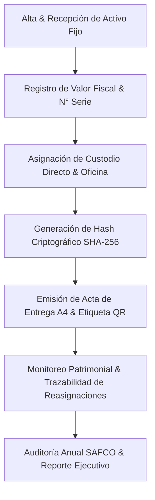

# 📦 Control de Activos Fijos & Inventario Patrimonial SAFCO

### **Gobernación Autónoma Departamental de Oruro (Bolivia)**
*Unidad de Bienes y Servicios · Fiscalización Patrimonial y Cumplimiento Ley N° 1178 (SAFCO)*


[](./index.html)
[](https://www.lexivox.org/packages/lexml/mostrar_jurisprudencia.php?sx=BO-L-1178)
[](#-nota-de-confidencialidad-y-alcance-del-prototipo)

---

> [!IMPORTANT]
> ### 🔒 Nota de Confidencialidad y Alcance del Prototipo Tecnológico
> **Exactitud Operativa y Carácter Demostrativo:** Este módulo representa un **prototipo arquitectónico, modelo funcional e inducción de ingeniería de software** desarrollado para la Unidad de Bienes y Servicios del Gobierno Autónomo Departamental de Oruro.
> 
> * **Réplica Exacta de la Lógica de Negocio:** La estructura de asignación de custodia a servidores públicos, la valoración fiscal en Bolivianos (Bs.), la codificación correlativa (`ACT-2026-XXXX`) y la emisión de **Actas de Entrega y Custodia A4** reproducen con **estricta exactitud operativa** las Normas Básicas del Sistema de Administración de Bienes y Servicios (SABS) de Bolivia.
> * **Protección de Datos e Infraestructura Segura:** Debido a que el inventario patrimonial real abarca vehículos, servidores informáticos y maquinaria de alto valor público sujeto a auditorías de la Contraloría General del Estado, **los sistemas definitivos de producción operan en servidores aislados y protegidos**. Este prototipo demuestra con total claridad la arquitectura, trazabilidad criptográfica y diseño de UI/UX sin exponer datos reales.

---

## 🔄 Evolución del Sistema: ¿Para qué era suficiente antes vs. En qué mejora este proyecto?

### 📂 1. ¿Para qué era suficiente la metodología tradicional?
Antes de la implementación de este módulo, el control de activos fijos se llevaba a cabo mediante **planillas físicas y tarjetas kardex de cartulina**:
* **Suficiente para registro estático:** Anotar las asignaciones de mobiliario y equipos en planillas impresas firmadas a mano.
* **Suficiente para conteos anuales presenciales:** Realizar inventarios físicos una vez al año revisando manualmente las placas y etiquetas pegadas en cada mueble o equipo.
* **Suficiente para transferencias internas sencillas:** Llenar comprobantes manuales de traspaso de activos entre dependencias de la Gobernación.

### ⚡ 2. ¿En qué mejora sustancialmente este proyecto?
Este nuevo sistema moderniza y cualifica de manera **exponencial** la administración patrimonial departamental:
1. **Acta de Asignación SAFCO A4 Membretada con Borrador en Vivo**: Generación instantánea y previsualización del Acta Oficial de Entrega al Custodio mientras se registran los datos del bien.
2. **Generador y Escáner de Etiquetas Autoadhesivas QR Criptográficas**: Herramienta interactiva para generar y escanear códigos QR que identifican inmediatamente el activo, su custodio y oficina.
3. **Seguridad Criptográfica y Auditoría (*Firma Hash SHA-256*)**: Cada activo asignado recibe un hash criptográfico de 256 bits que certifica la responsabilidad legal e impide alteraciones en actas de entrega.
4. **Trazabilidad y Reasignaciones de Custodio (*Audit Timeline*)**: Historial visual paso a paso de cada movimiento patrimonial (*Alta ➔ Asignación de Custodio ➔ Inspección ➔ Reasignación/Mantenimiento*).
5. **Analítica Patrimonial**: Pestaña dedicada a la consolidación de valor fiscal por categoría (*Computación, Vehículos, Muebles, Maquinaria*) y estado de conservación.
6. **Reportes Ejecutivos e Impresión A4**: Generación instantánea de informes consolidados de activos fijos para Auditoría Interna SAFCO.

---

## 📐 Flujo de Control Patrimonial (Ley N° 1178 SAFCO)



---

## 📋 Categorías Patrimoniales SAFCO (GAD-ORU)

| Categoría SAFCO | Descripción / Ejemplos | Criterio de Depreciación Legal |
|---|---|---|
| **Equipos de Computación** | Laptops, Servidores Rack, Impreosras, Switches | 4 Años (25% Anual) |
| **Vehículos Terrestres** | Camionetas SEDECA 4x4, Vagonetas Oficiales, Ambulancias | 5 Años (20% Anual) |
| **Muebles y Enseres** | Escritorios de Roble, Sillones Ejecutivos, Estanterías | 10 Años (10% Anual) |
| **Maquinaria y Equipos** | Generadores Eléctricos, Tractores, Equipo Pesado | 8 Años (12.5% Anual) |
| **Equipos de Comunicación** | Radios VHF Motorola, Repetidoras, Antenas | 5 Años (20% Anual) |

---

## ⚖️ Matriz de Cumplimiento Normativo (Bolivia & GAD-ORU)

| Norma | Mandato Legal | Aplicación en el Sistema de Activos |
|---|---|---|
| **Ley N° 1178 (SAFCO)** | Regula los Sistemas de Administración y de Control de los Recursos del Estado. | Registro de responsabilidad de custodios directos e integridad auditora. |
| **SABS (D.S. 0181)** | Normas Básicas del Sistema de Administración de Bienes y Servicios. | Procedimientos de alta, inventariación, custodia, baja y reasignación. |
| **Resoluciones GAD-ORU** | Reglamentos Departamentales de Manejo de Bienes Públicos. | Codificación correlativa `ACT-2026-XXXX` y formato membretado A4. |

---

## 🧪 Guía de Pruebas de QA e Inducción Paso a Paso

1. **Caso 1: Incorporación de Nuevo Activo Fijo**
   * Ve a **Registrar Activo**.
   * Ingresa `Servidor PowerEdge`, asigna custodio y valor `45000.00`.
   * *Resultado:* Se abrirá el modal con el **Acta de Entrega A4 membretada con Firma Hash SHA-256**.

2. **Caso 2: Generación e Impresión de Etiqueta QR**
   * Ve a **Generador / Escáner QR** en el menú lateral.
   * Ingresa `ACT-2026-0001` y haz clic en **Generar Etiqueta QR**.
   * *Resultado:* Renderizará la tarjeta autoadhesiva patrimonial con código QR lista para imprimir sticker.

3. **Caso 3: Consulta de Analítica Patrimonial**
   * Ve a la pestaña **Analítica Patrimonial**.
   * *Resultado:* Mostrará las barras de distribución del valor fiscal total en Bolivianos (Bs.) clasificadas por categoría.

---

## 📂 Arquitectura del Módulo

```text
control-activos/
├── index.html                   # Dashboard de inventario, split-screen de registro, generador QR y modales A4
├── README.md                    # Documentación técnica, diagramas Mermaid, normas SABS y guía de QA
├── assets/
│   ├── banner.png               # Banner panorámico oficial (1000 x 300 px)
│   └── css/
│       └── styles.css           # Design Tokens (Cyber-Gold & Navy), estilos QR e impresión A4
└── src/
    └── main.js                  # Lógica de inventario, firma hash SHA-256, escáner QR y analítica patrimonial
```

---

*Gobierno Autónomo Departamental de Oruro — Unidad de Bienes y Servicios*
