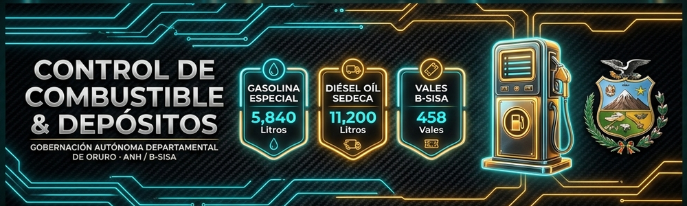
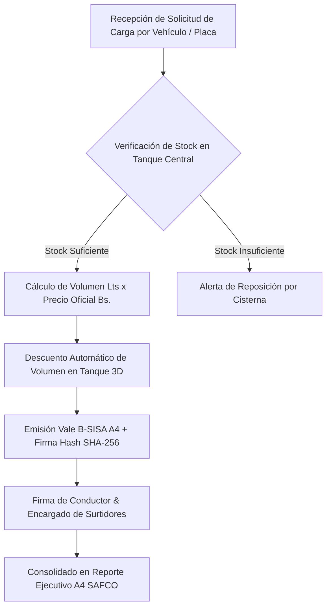

# ⛽ Control de Combustible & Depósitos Oficiales (B-SISA)

### **Gobernación Autónoma Departamental de Oruro (Bolivia)**
*Tesorería Departamental · Surtidor Central & Depósitos de Carburantes SEDECA*



[](./index.html)
[](https://www.anh.gob.bo)
[](https://www.lexivox.org/packages/lexml/mostrar_jurisprudencia.php?sx=BO-L-1178)

---

> [!IMPORTANT]
> ### 🔒 Nota de Confidencialidad y Alcance del Prototipo Tecnológico
> **Exactitud Operativa y Carácter Demostrativo:** Este módulo representa un **prototipo arquitectónico, modelo funcional e inducción de ingeniería de software** desarrollado para la Tesorería Departamental y el Control de Carburantes del Gobierno Autónomo Departamental de Oruro.
> 
> * **Réplica Exacta de la Lógica de Negocio:** La simulación de volumen de depósitos centrales (Gasolina Especial y Diésel Oíl SEDECA), los precios oficiales subvencionados de Bolivia (Bs. 3.74/Lt Gasolina, Bs. 3.72/Lt Diésel) y la emisión de **Vales de Combustible B-SISA A4** reproducen con **estricta exactitud operativa** las regulaciones de la Agencia Nacional de Hidrocarburos (ANH).
> * **Protección de Datos e Infraestructura Segura:** Debido a que el despacho de combustible involucra cupos del parque automotor y auditorías de fiscalización de recursos estratégicos, **los sistemas definitivos de producción operan en servidores gubernamentales protegidos**. Este prototipo demuestra con total transparencia la precisión técnica y modularidad de la solución.

---

## 🔄 Evolución del Sistema: ¿Para qué era suficiente antes vs. En qué mejora este proyecto?

### 📂 1. ¿Para qué era suficiente la metodología tradicional?
Antes de la implementación de este panel de control de surtidores, la asignación de combustible se realizaba con **vales físicos talonarios de papel impreso**:
* **Suficiente para entrega de vales en mano:** Firmar talonarios de papel y entregarlos a los choferes de la Gobernación.
* **Suficiente para conteo manual a fin de mes:** Sumar manualmente los litros asignados en planillas de liquidación.
* **Suficiente para control básico de stock:** Medir visualmente o con varilla el nivel de los depósitos centrales una vez a la semana.

### ⚡ 2. ¿En qué mejora sustancialmente este proyecto?
Este módulo digitaliza y asegura el control patrimonial de carburantes:
1. **Visualización 3D Dinámica de Tanques de Depósito**: Monitoreo en tiempo real del volumen y porcentaje disponible en el *Depósito Central 01 (Gasolina Especial)* y *Depósito Caminero 02 (Diésel Oíl SEDECA)* con animación líquida.
2. **Emisión Digital de Vales de Combustible B-SISA A4**: Generación instantánea de vales membretados A4 con código `VALE-2026-XXXX`, placa del vehículo, conductor autorizado y costo fiscal exacto.
3. **Control Criptográfico e Integridad SHA-256**: Cada vale emitido genera un Hash de 256 bits y un código QR de validación ANH que impide la duplicación o alteración de cupones.
4. **Mantenimiento y Reposición de Tanques**: Herramienta interactiva para registrar ingresos de camiones cisterna y actualización automática de inventarios de surtidor.
5. **Reportes Ejecutivos A4 para Auditoría SAFCO**: Consolidado de consumo por Secretaría o Unidad para auditorías de la Contraloría General del Estado.

---

## 📐 Flujo de Despacho de Carburantes (ANH / B-SISA)



---

## ⛽ Precios Oficiales de Carburantes Subvencionados (Bolivia)

| Carburante | Precio Oficial (Bs. / Litro) | Aplicación Típica en Oruro |
|---|---|---|
| **Gasolina Especial** | **Bs. 3.74 / Lt** | Vehículos livianos, vagonetas oficiales, camionetas de supervisión. |
| **Diésel Oíl SEDECA** | **Bs. 3.72 / Lt** | Maquinaria pesada caminera, volquetas, tractores, generadores. |

---

## 🧪 Guía de Pruebas de QA e Inducción Paso a Paso

1. **Caso 1: Emisión de Vale de Despacho de Gasolina**
   * Haz clic en **+ Nuevo Despacho**.
   * Selecciona `Camioneta Toyota Hilux`, `Secretaría General` e ingresa `50.0 Lts`.
   * *Resultado:* Calculará `Bs. 187,00`, descontará los 50 litros del Tanque de Gasolina en tiempo real y abrirá el **Vale A4 Membretado SAFCO**.

2. **Caso 2: Reposición de Tanque Central por Cisterna**
   * En la tarjeta del Tanque de Diésel, haz clic en **+ Reponer**.
   * Ingresa `1000` litros.
   * *Resultado:* El nivel del tanque subirá automáticamente y emitirá un toast de confirmación.

3. **Caso 3: Impresión de Informe Ejecutivo de Carburantes**
   * Haz clic en **Informe A4** en el encabezado de la tabla.
   * *Resultado:* Renderizará la planilla consolidada de consumo de combustible lista para imprimir.

---

## 📂 Arquitectura del Módulo

```text
control-combustible/
├── index.html                   # Dashboard con tanques 3D, planilla de vales y modales A4
├── README.md                    # Documentación técnica, normas ANH B-SISA, precios y guía QA
├── assets/
│   ├── banner.png               # Banner panorámico oficial (1000 x 300 px)
│   └── css/
│       └── styles.css           # Design Tokens, animaciones líquidas de tanques y estilos de impresión A4
└── src/
    └── main.js                  # Lógica de tanques, precios de carburante, vales A4 y reportes
```

---

*Gobierno Autónomo Departamental de Oruro — Tesorería & Control de Carburantes SAFCO*
