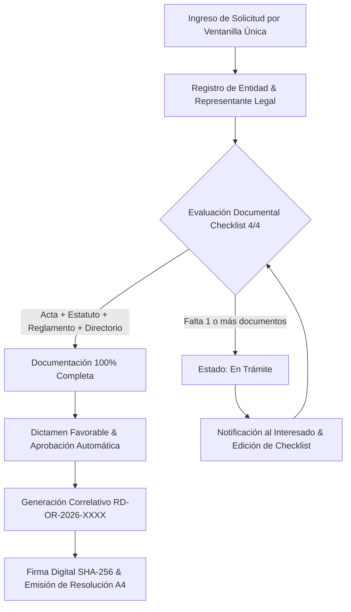

# 📜 Consola Jurídica — Registro y Emisión de Personerías Jurídicas

### **Gobernación Autónoma Departamental de Oruro (Bolivia)**
*Dirección General de Asuntos Jurídicos · Fiscalización y Cumplimiento Ley N° 031 Marco de Autonomías y Descentralización*


[](./index.html)
[](https://www.lexivox.org/packages/lexml/mostrar_jurisprudencia.php?sx=BO-L-N31)
[](#-nota-de-confidencialidad-y-alcance-del-prototipo)

---

> [!IMPORTANT]
> ### 🔒 Nota de Confidencialidad y Alcance del Prototipo Tecnológico
> **Exactitud Operativa y Carácter Demostrativo:** Este módulo representa un **prototipo arquitectónico, modelo funcional e inducción de ingeniería de software** desarrollado para la Dirección General de Asuntos Jurídicos del Gobierno Autónomo Departamental de Oruro.
> 
> * **Réplica Exacta de la Lógica de Negocio:** La estructura de validación documental (Checklist 4/4), la clasificación por las 16 provincias de Oruro, la numeración correlativa institucional (`RD-OR-2026-XXXX`) y la emisión membretada A4 reproducen con **estricta exactitud operativa** los flujos de fiscalización legal estipulados por la Ley N° 031.
> * **Protección de Datos e Infraestructura Segura:** Debido a que el manejo de expedientes gubernamentales reales involucra información institucional confidencial, firmas de autoridades y resoluciones normativas sujetas a auditorías del Estado (SAFCO), **los sistemas definitivos de producción operan en entornos aislados y de alta seguridad dentro de la red gubernamental**. Este prototipo demuestra con total transparencia la precisión técnica, modularidad y excelencia de UI/UX alcanzadas, sin exponer bases de datos reales ni información privilegiada.

---

## 🔄 Evolución del Sistema: ¿Para qué era suficiente antes vs. En qué mejora este proyecto?

### 📂 1. ¿Para qué era suficiente la metodología tradicional?
Antes de la implementación de esta consola digital, la gestión de personerías jurídicas se llevaba a cabo mediante **libros de recepción presencial y planillas locales**:
* **Suficiente para flujos de bajo volumen:** Permitía anotar manualmente la entrada de carpetas en cuadernos de ventanilla o tablas de Excel independientes.
* **Suficiente para consultas presenciales:** Los representantes debían acudir físicamente a las oficinas de la Gobernación en Oruro para averiguar el estado de su trámite.
* **Suficiente para transcripción manual:** La redacción de cada Resolución Administrativa se realizaba de forma individual en procesadores de texto, llenando nombres y datos uno a uno.

### ⚡ 2. ¿En qué mejora sustancialmente este proyecto?
Esta nueva Consola Jurídica moderniza y cualifica de manera **exponencial** el servicio público departamental:
1. **Redacción Automatizada sin Error Humano (*Borrador en Vivo*)**: La interfaz split-screen actualiza en tiempo real el borrador membretado de la Resolución Administrativa a medida que el operador ingresa los datos, asignando correlativos únicos.
2. **Fiscalización Estandarizada y Transparente (*Checklist 4/4*)**: Valida objetivamente la entrega del Acta de Fundación, Estatuto Orgánico, Reglamento Interno y Posesión de Directorio según la Ley N° 031, impidiendo dictámenes favorables si faltan documentos.
3. **Seguridad Criptográfica y Auditoría SAFCO (*Firma Digital SHA-256*)**: Genera un código hash único de 256 bits y un código QR de validación que certifica la validez legal del documento e impide alteraciones.
4. **Trazabilidad del Expediente (*Audit Timeline*)**: Permite visualizar la línea de tiempo del trámite desde Ventanilla Única hasta la Firma del Gobernador.
5. **Verificador Digital de Autenticidad**: Herramienta integrada para que autoridades y ciudadanos verifiquen la validez de cualquier resolución ingresando su código o código hash.
6. **Cobertura Territorial Departamental (16 Provincias)**: Filtrado nativo para el control geográfico de expedientes en todas las provincias de Oruro.
7. **Reportes Ejecutivos e Impresión Membretada A4**: Generación instantánea de informes consolidados de gestión e impresiones oficiales adaptadas a papel A4/Carta con marca de agua institucional.

---

## 📐 Flujo del Proceso Legal de Fiscalización



---

## 🗺️ Cobertura Territorial — 16 Provincias del Departamento de Oruro

El sistema soporta la categorización y filtrado geoestadístico de las **16 Provincias oficiales de Oruro**:

| # | Provincia | Cabecera / Municipio Principal | Clasificación Frecuente |
|---|---|---|---|
| 1 | **Cercado** | Oruro | OTB / Juntas Vecinales, Asociaciones Civiles |
| 2 | **Eduardo Abaroa** | Challapata | Sindicatos Agrarios, Comunidades Originarias |
| 3 | **Carangas** | Corque | Comunidades Indígenas Originarias |
| 4 | **Poopó** | Poopó | Sindicatos Mineros y Agrarios |
| 5 | **Sajama** | Curahuara de Carangas | Comunidades Originarias y Ganaderas |
| 6 | **Sabaya** | Sabaya | Comunidades Fronterizas Originarias |
| 7 | **Pantaleón Dalence** | Huanuni | Sindicatos Mineros y Gremiales |
| 8 | **Ladislao Cabrera** | Salinas de Garci Mendoza | Asociaciones de Productores de Quinua |
| 9 | **Sebastián Pagador** | Santiago de Huari | Comunidades Originarias y Productivas |
| 10 | **Saucarí** | Toledo | Comunidades Agropecuarias |
| 11 | **Nor Carangas** | Huayllamarca | Comunidades Indígenas |
| 12 | **San Pedro de Totora** | Totora | Capital de la Tarqueada - Originaria |
| 13 | **Tomas Barrón** | Eucaliptus | Asociaciones de Productores |
| 14 | **Sur Carangas** | Andamarca | Comunidades Originarias |
| 15 | **Puerto de Mejillones** | La Rivera | Comunidades Fronterizas |
| 16 | **Guarayos / Mejillones** | Todos Santos | Asociaciones Civiles |

---

## ⚖️ Matriz de Cumplimiento Normativo (Bolivia & GAD-ORU)

| Norma | Ámbito / Mandato Legal | Aplicación en la Consola Jurídica |
|---|---|---|
| **CPE Art. 300** | Competencias exclusivas de los Gobiernos Departamentales Autónomos. | Otorgación e inscripción de Personerías Jurídicas a organizaciones civiles departamentales. |
| **Ley N° 031** | Marco de Autonomías y Descentralización "Andrés Ibáñez". | Requisitos sustantivos de legalidad del Estatuto y Reglamento Interno. |
| **Ley N° 1178** | Administración y Control Gubernamentales (SAFCO). | Registro de trazabilidad de auditoría e integridad documental Hash SHA-256. |
| **D.D. GAD-ORU** | Reglamentos Departamentales de Otorgación de Personerías. | Lógica de correlativos `RD-OR-2026-XXXX` y formato membretado de resolución. |

---

## 🧪 Guía de Pruebas e Inducción Paso a Paso (Test Plan)

Para evaluar el funcionamiento completo de la Consola Jurídica en modo inducción:

1. **Caso 1: Registro Incompleto (`En Trámite`)**
   * Ve a **Nueva Solicitud**.
   * Llena el nombre de la entidad y representante, pero marca únicamente 2 de los 4 requisitos.
   * *Resultado esperado:* El borrador en vivo indicará `50% Completado - EN TRÁMITE`. Al guardar, se registrará con badge amarillo.

2. **Caso 2: Registro 100% Completo (`Aprobación Instantánea`)**
   * En **Nueva Solicitud**, marca los 4 requisitos del checklist.
   * *Resultado esperado:* El medidor cambiará a `100% Aprobado` y se abrirá automáticamente el modal con la **Resolución A4 membretada y Firma Hash SHA-256**.

3. **Caso 3: Edición Rápida de Requisitos en la Tabla**
   * En la Bandeja de Control, haz clic sobre los micro-chips de documentos de una fila `En Trámite`.
   * *Resultado esperado:* Se abrirá el modal **Verificar Requisitos Documentales**. Marca los faltantes y guarda. El estado pasará a `Aprobado` en tiempo real.

4. **Caso 4: Trazabilidad y Verificador Digital**
   * Haz clic en el botón **`Trazabilidad`** para ver el timeline del expediente.
   * Abre **Verificar Firma QR / Hash** en el menú lateral e ingresa `RD-OR-2026-0001` para verificar el certificado de autenticidad.

---

## 📂 Arquitectura de Software

```text
control-personerias/
├── index.html                   # Dashboard legal, split-screen de registro, verificador digital, timeline y modales
├── README.md                    # Documentación técnica, diagramas Mermaid, marco legal y guía de QA
├── assets/
│   └── css/
│       └── styles.css           # Design Tokens (Cinzel Gold & Navy), glassmorphism y estilos de impresión A4
└── src/
    └── main.js                  # Lógica de negocio, borrador en vivo, firma hash SHA-256, verificador y reportes
```

---

*Gobierno Autónomo Departamental de Oruro — Modernización Jurídica, Transparencia e Innovación Digital*
