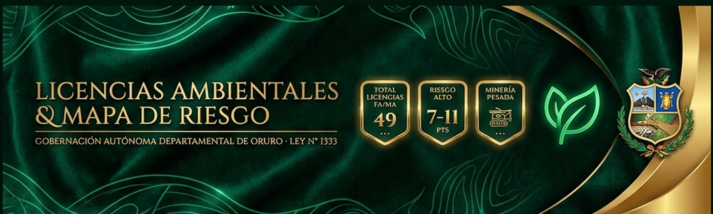
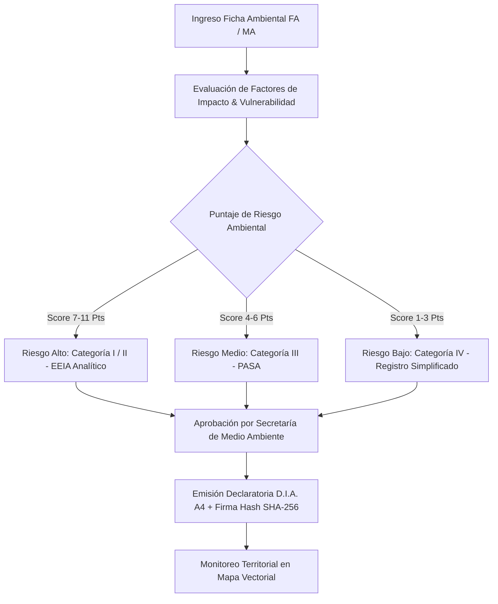

# 🌿 Licencias Ambientales & Mapa de Riesgo Territorial

### **Gobernación Autónoma Departamental de Oruro (Bolivia)**
*Secretaría Departamental de Medio Ambiente y Agua · Fiscalización y Cumplimiento Ley N° 1333 de Medio Ambiente*



[](./index.html)
[](https://www.lexivox.org/packages/lexml/mostrar_jurisprudencia.php?sx=BO-L-1333)
[](#-nota-de-confidencialidad-y-alcance-del-prototipo)

---

> [!IMPORTANT]
> ### 🔒 Nota de Confidencialidad y Alcance del Prototipo Tecnológico
> **Exactitud Operativa y Carácter Demostrativo:** Este módulo representa un **prototipo arquitectónico, modelo funcional e inducción de ingeniería de software** desarrollado para la Secretaría Departamental de Medio Ambiente y Agua del Gobierno Autónomo Departamental de Oruro.
> 
> * **Réplica Exacta de la Lógica de Negocio:** La estructura de matriz de categorización ambiental (Categorías I, II, III y IV según la Ley N° 1333), la asignación de puntaje de riesgo territorial (1-11 Pts), la delimitación por las 16 provincias de Oruro y la emisión de la **Declaratoria de Impacto Ambiental (D.I.A.)** en formato A4 reproducen con **estricta exactitud operativa** los flujos de fiscalización ambiental de Bolivia.
> * **Protección de Datos e Infraestructura Segura:** Debido a que las inspecciones a mineras, plantas agroindustriales e infraestructuras viales involucran auditorías ambientales confidenciales, **los sistemas definitivos de producción operan en servidores gubernamentales protegidos**. Este prototipo demuestra con total transparencia la precisión técnica y modularidad de la solución sin exponer datos reales sensibles.

---

## 🔄 Evolución del Sistema: ¿Para qué era suficiente antes vs. En qué mejora este proyecto?

### 📂 1. ¿Para qué era suficiente la metodología tradicional?
Antes de la implementación de este panel de control territorial, el registro de Licencias Ambientales (FA/MA) se realizaba mediante **archivos en papel y planillas desarticuladas**:
* **Suficiente para registro estático:** Archivar copias físicas de las Fichas Ambientales (FA) y Manifiestos Ambientales (MA) en carpetas administrativas.
* **Suficiente para inspecciones aisladas:** Los inspectores realizaban visitas de campo sin un mapa vectorial interactivo que mostrara el nivel de riesgo acumulado por provincia.
* **Suficiente para transcripción manual:** La redacción de las Declaratorias de Impacto Ambiental (D.I.A.) se realizaba individualmente en procesadores de texto sin firma criptográfica.

### ⚡ 2. ¿En qué mejora sustancialmente este proyecto?
Este nuevo módulo transforma la fiscalización ambiental departamental:
1. **Mapa Vectorial Interactivo de Riesgo Territorial**: Visualizador dinámico SVG de las 16 provincias de Oruro con código de color dinámico según el riesgo ambiental acumulado (*Riesgo Bajo 1-3 Pts*, *Medio 4-6 Pts*, *Alto 7-11 Pts*).
2. **Calculadora Automática de Categorización Ley N° 1333**: Formulario con matriz de vulnerabilidad (fuentes de agua, centros poblados, áreas protegidas) que calcula el puntaje de impacto y asigna la **Categoría I, II, III o IV** en tiempo real.
3. **Borrador en Vivo de la Declaratoria D.I.A.**: Previsualización instantánea del certificado oficial a medida que se registran los datos del proyecto.
4. **Seguridad Criptográfica SHA-256 & QR**: Asignación de hash de 256 bits y código QR de validación que certifica la validez legal del documento contra falsificaciones.
5. **Línea de Tiempo de Inspección Ambiental (*Timeline Audit*)**: Historial paso a paso (*Ingreso FA/MA ➔ Inspección In Situ ➔ Categorización PASA ➔ Licencia D.I.A.*).
6. **Verificador Digital Público**: Herramienta integrada para validar cualquier licencia ambiental mediante su código `LIC-2026-XXXX` o Hash SHA-256.
7. **Reportes de Auditoría e Impresión A4**: Emisión membretada del Certificado D.I.A. e Informes Ejecutivos en papel A4/Carta con marca de agua oficial.

---

## 📐 Flujo de Fiscalización Ambiental (Ley N° 1333)



---

## 🍃 Matriz de Categorización Ambiental (Ley N° 1333 Bolivia)

| Categoría | Nivel de Impacto | Exigencia Técnica Legal | Ejemplo de Proyecto en Oruro |
|---|---|---|---|
| **Categoría I** | Alto Impacto Significativo | Estudio de Evaluación de Impacto Ambiental (EEIA) Analítico Integrativo. | Minería Pesada / Diques de Colas (Huanuni, Bolívar) |
| **Categoría II** | Alto Impacto Específico | EEIA Analítico Específico por factor ambiental afectado. | Concentración de Minerales / Plantas Químicas |
| **Categoría III** | Impacto Moderado | Plan de Aplicación y Seguimiento Ambiental (PASA). | Agroindustria / Lácteos Challapata |
| **Categoría IV** | Impacto Insignificante | Registro Ambiental Simplificado y Medidas Generales. | Infraestructura Urbana / Pavimentado de Vías |

---

## 🗺️ Cobertura Territorial — 16 Provincias del Departamento de Oruro

| # | Provincia | Cabecera / Municipio | Sensibilidad Ambiental Frecuente |
|---|---|---|---|
| 1 | **Pantaleón Dalence** | Huanuni | Cuencas hidrográficas y relaves mineros (Riesgo Alto) |
| 2 | **Poopó** | Poopó | Actividad minera e impacto en el Lago Poopó (Riesgo Alto) |
| 3 | **Eduardo Abaroa** | Challapata | Actividad agroindustrial y recursos hídricos (Riesgo Medio) |
| 4 | **Ladislao Cabrera** | Salinas de Garci Mendoza | Producción de quinua y conservación de suelos (Riesgo Medio) |
| 5 | **Cercado** | Oruro | Infraestructura urbana y efluentes industriales (Riesgo Bajo/Medio) |
| 6 | **Sajama** | Curahuara de Carangas | Parque Nacional Sajama / Área Protegida (Riesgo Sensible) |
| 7 | **Sabaya** | Sabaya | Proyectos de riego e infraestructura (Riesgo Medio) |
| 8 | **Carangas** | Corque | Conservación de fauna originaria y pastizales |
| 9 | **Sebastián Pagador** | Santiago de Huari | Industria de bebidas e impacto hídrico |
| 10 | **Saucarí** | Toledo | Cuencas de ríos y ganadería auquénida |
| 11 | **Nor Carangas** | Huayllamarca | Agropecuaria y pequeños proyectos |
| 12 | **San Pedro de Totora** | Totora | Conservación de ecosistemas de alta montaña |
| 13 | **Tomas Barrón** | Eucaliptus | Proyectos de infraestructura |
| 14 | **Sur Carangas** | Andamarca | Manejo de recursos hídricos |
| 15 | **Puerto de Mejillones** | La Rivera | Microcuencas fronterizas |
| 16 | **Litoral** | Huachacalla | Vías de transporte y servicios |

---

## 🧪 Guía de Pruebas de QA e Inducción Paso a Paso

1. **Caso 1: Evaluación de Proyecto Minero (Riesgo Alto - Categoría I)**
   * Ve a **Nueva Licencia D.I.A.**.
   * Ingresa `Cooperativa Minera San José`, selecciona `Minería Pesada`, provincia `Dalence` y marca las 3 casillas de vulnerabilidad (Agua, Población, Reserva).
   * *Resultado:* El puntaje calculará `11 Pts (Riesgo Alto - Categoría I/II)`. Al guardar, emitirá el Certificado D.I.A. y pintará la provincia en **rojo** en el mapa.

2. **Caso 2: Evaluación de Proyecto Agroindustrial (Riesgo Medio)**
   * Registra un proyecto con sector `Agroindustrial` y solo 1 vulnerabilidad marcada.
   * *Resultado:* Calculará `4 Pts (Riesgo Medio - Categoría III)` y se pintará en **ámbar** en el mapa.

3. **Caso 3: Verificación Criptográfica y Trazabilidad**
   * Haz clic en **Trazabilidad** en la tabla para auditar los 4 pasos del proceso.
   * Ve a **Verificar Licencia QR / Hash** en la barra lateral e ingresa `LIC-2026-0001` para comprobar la firma digital.

---

## 📂 Arquitectura del Módulo

```text
licencias-ambientales/
├── index.html                   # Dashboard territorial, mapa SVG, split-screen, verificador y modales D.I.A.
├── README.md                    # Documentación técnica, matriz Ley 1333 y mapa de pruebas
├── assets/
│   ├── banner.png               # Banner panorámico oficial (1000 x 300 px)
│   └── css/
│       └── styles.css           # Design Tokens (Bio-Emerald & Jade), SVG Map styles e impresión A4
└── src/
    └── main.js                  # Lógica de categorización Ley 1333, mapa SVG dinámico, hash SHA-256 y certificados
```

---

*Gobierno Autónomo Departamental de Oruro — Secretaría de Medio Ambiente y Agua*
