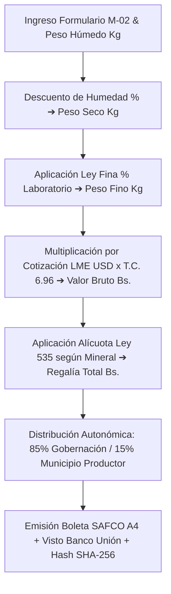

# 🪙 SISREMIN — Liquidación de Regalías Mineras (Ley N° 535)

### **Gobernación Autónoma Departamental de Oruro (Bolivia)**
*Dirección de Minería y Metalurgia · Fiscalización Tributaria Patrimonial*


[](./index.html)
[](https://www.lexivox.org/packages/lexml/mostrar_jurisprudencia.php?sx=BO-L-535)
[](#-nota-de-confidencialidad-y-alcance-del-prototipo)

---

> [!IMPORTANT]
> ### 🔒 Nota de Confidencialidad y Alcance del Prototipo Tecnológico
> **Exactitud Operativa y Carácter Demostrativo:** Este módulo representa un **prototipo arquitectónico, modelo funcional e inducción de ingeniería de software** desarrollado para la Dirección de Minería y Metalurgia del Gobierno Autónomo Departamental de Oruro.
> 
> * **Réplica Exacta de la Lógica de Negocio:** La fórmula de cálculo metalúrgico de Ley Fina, la aplicación de alícuotas tributarias por mineral según la Ley N° 535, la distribución autonómica (85% Gobernación / 15% Municipios) y la emisión de **Boletas de Pre-Liquidación SAFCO A4** reproducen con **estricta exactitud operativa** los flujos tributarios del Estado Plurinacional de Bolivia.
> * **Protección de Datos e Infraestructura Segura:** Debido a que la tributación minera involucra declaraciones juradas confidenciales (Formulario M-02), **los sistemas definitivos de producción operan en servidores bancarios y gubernamentales aislados**. Este prototipo demuestra con total claridad la precisión técnica y modularidad del sistema.

---

## 🔄 Evolución del Sistema: ¿Para qué era suficiente antes vs. En qué mejora este proyecto?

### 📂 1. ¿Para qué era suficiente la metodología tradicional?
Antes de la implementación de SISREMIN, la liquidación de regalías mineras se realizaba mediante **formularios manuales en papel e impresiones simples**:
* **Suficiente para registro estático de pesos:** Transcribir el peso húmedo reportado en balanza y aplicar un porcentaje estimado de humedad.
* **Suficiente para cálculo manual unitario:** Multiplicar manualmente la ley de mineral por la cotización oficial quincenal publicada por el Ministerio de Minería.
* **Suficiente para cobro por ventanilla tradicional:** Llenar comprobantes manuales de pago para depósito bancario.

### ⚡ 2. ¿En qué mejora sustancialmente este proyecto?
Este módulo transforma la fiscalización tributaria minera departamental:
1. **Calculadora Metalúrgica y Tributaria en Tiempo Real**: Cálculo automático de Peso Seco (Kg), Peso Fino (Kg), Valor Bruto de Venta (Bs.) y Regalía Minera con tipo de cambio oficial (Bs. 6.96 / USD).
2. **Distribución Autonómica Automatizada (Ley N° 535)**:
   * **85% Gobernación Autónoma Departamental de Oruro**: Destinado a proyectos viales e infraestructura pública.
   * **15% Municipio Productor**: Asignación automática al municipio de origen (Huanuni, Poopó, Antequera, Challapata, etc.).
3. **Boleta Oficial de Pre-Liquidación A4 Membretada**: Emisión de boletas A4 oficiales con desglose metalúrgico, visto técnico del Banco Unión, sello institucional y Hash SHA-256 de seguridad.
4. **Alícuotas Dinámicas por Mineral (Ley N° 535)**: Tabla de alícuotas oficial (Estaño 5%, Plata 6%, Zinc 5%, Plomo 5%, Oro 7%, Cobre 5%).
5. **Informe Ejecutivo Consolidad para Gobernador y Asamblea**: Planilla consolidada A4 de recaudación patrimonial minera.

---

## 📐 Flujo de Liquidación Tributaria Minera (Ley N° 535)



---

## ⛏️ Tabla de Alícuotas de Regalía Minera (Ley N° 535 Bolivia)

| Mineral / Concentrado | Símbolo | Alícuota Tributaria | Municipio Principal en Oruro |
|---|---|---|---|
| **Estaño** | Sn | **5.0 %** | Huanuni (Pantaleón Dalence) |
| **Plata** | Ag | **6.0 %** | Antequera / San José |
| **Zinc** | Zn | **5.0 %** | Poopó / Colquiri-Poopó |
| **Plomo** | Pb | **5.0 %** | Machacamarca / Antequera |
| **Oro** | Au | **7.0 %** | Salinas de Garci Mendoza |
| **Cobre** | Cu | **5.0 %** | Corque (Carangas) |

---

## 🧪 Guía de Pruebas de QA e Inducción Paso a Paso

1. **Caso 1: Liquidación de Concentrado de Estaño (Huanuni)**
   * Ingresa `Cooperativa Minera Huanuni`, mineral `Estaño (Sn)`, peso `10000 Kg`, humedad `3.5%`, ley `48.5%`, cotización `USD 14.50`.
   * *Resultado:* Calculará `Peso Fino: 4,679.75 Kg`, `Valor Bruto: Bs. 472.120,00` y `Regalía Total: Bs. 23.606,00` (85% Gobernación = `Bs. 20.065,10` | 15% Municipio = `Bs. 3.540,90`).
   * Abre la **Boleta A4** para previsualizar el certificado oficial.

2. **Caso 2: Impresión de Reporte Ejecutivo Consolidad**
   * En la barra lateral, haz clic en **Informe Ejecutivo A4**.
   * *Resultado:* Renderizará la planilla A4 consolidada de recaudación minera.

---

## 📂 Arquitectura del Módulo

```text
liquidacion-regalias/
├── index.html                   # Dashboard tributario, calculadora metalúrgica y modales A4
├── README.md                    # Documentación técnica, fórmulas metalúrgicas, alícuotas Ley 535 y guía QA
├── assets/
│   ├── banner.png               # Banner panorámico oficial (1000 x 300 px)
│   └── css/
│       └── styles.css           # Design Tokens (Metallic Gold), tablas y estilos de impresión A4
└── src/
    └── main.js                  # Lógica metalúrgica, alícuotas Ley 535, distribución 85/15 y reportes
```

---

*Gobierno Autónomo Departamental de Oruro — Dirección de Minería y Metalurgia*
