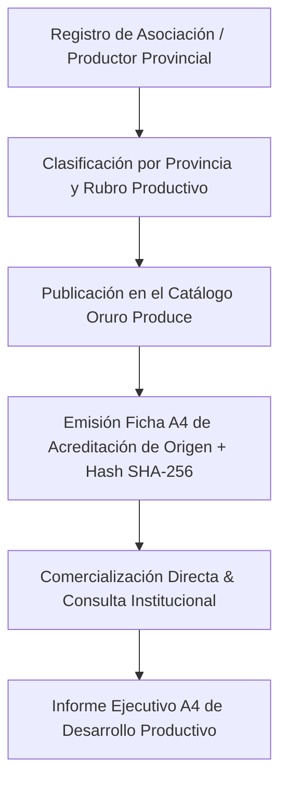

# 🌾 Oruro Produce Marketplace — Feria Virtual de las 16 Provincias

### **Gobernación Autónoma Departamental de Oruro (Bolivia)**
*Secretaría Departamental de Desarrollo Productivo y Economía Plural*


[](./index.html)
[](https://www.lexivox.org/packages/lexml/mostrar_jurisprudencia.php?sx=BO-L-031)
[](#-nota-de-confidencialidad-y-alcance-del-prototipo)

---

> [!IMPORTANT]
> ### 🔒 Nota de Confidencialidad y Alcance del Prototipo Tecnológico
> **Exactitud Operativa y Carácter Demostrativo:** Este módulo representa un **prototipo arquitectónico, modelo funcional e inducción de ingeniería de software** desarrollado para la Secretaría Departamental de Desarrollo Productivo del Gobierno Autónomo Departamental de Oruro.
> 
> * **Réplica Exacta de la Oferta Productiva:** Los catálogos de productores agropecuarios (Quinua Real de Salinas), ganadería camélida (Charque y Fibra de Alpaca de Challapata), textiles artesanales y artesanía minera de las 16 provincias, y la emisión de **Acreditaciones de Productor A4**, reproducen fielmente los estándares del sector.
> * **Protección de Datos e Infraestructura Segura:** Este prototipo demuestra con total claridad la precisión técnica y modularidad del sistema.

---

## 🔄 Evolución del Sistema: ¿Para qué era suficiente antes vs. En qué mejora este proyecto?

### 📂 1. ¿Para qué era suficiente la metodología tradicional?
Antes de la implementación de este marketplace, los productores dependían de **ferias físicas itinerantes**:
* **Suficiente para comercialización local esporádica:** Vender productos en ferias dominicales o festividades provinciales.
* **Suficiente para folletos impresos:** Repartir volantes de papel en puestos de venta.

### ⚡ 2. ¿En qué mejora sustancialmente este proyecto?
Este módulo impulsa la economía plural departamental:
1. **Catálogo Digital de las 16 Provincias**: Oferta permanente de Quinua Real, carne de llama, artesanías y textiles.
2. **Filtros por Origen y Categoría**: Búsqueda instantánea por provincia (Ladislao Cabrera, Eduardo Abaroa, Sajama, Pantaleón Dalence, etc.).
3. **Certificado de Productor A4 Membretado SAFCO**: Emisión e impresión oficial de fichas A4 de origen con precios en Bolivianos (Bs.), sello institucional y Hash SHA-256 de seguridad.
4. **Informe Ejecutivo A4 del Mercado Departamental**: Consolidado de oferta productiva para la Secretaría de Desarrollo Productivo.

---

## 📐 Flujo Comercial & Acreditación de Origen



---

## 📍 Productos Emblemáticos por Provincia (Oruro Produce)

| Provincia | Capital | Rubro Principal | Producto Emblemático |
|---|---|---|---|
| **Ladislao Cabrera** | Salinas de Garci Mendoza | Agrícola | **Quinua Real Blanca Orgánica** |
| **Eduardo Abaroa** | Challapata | Ganadería Camélida | **Charque de Llama & Lacteo Altiplánico** |
| **Sajama** | Curahuara de Carangas | Textilería | **Ponchos y Chalinas de Alpaca** |
| **Pantaleón Dalence** | Huanuni | Artesanía Minera | **Esculturas en Estaño Puro** |
| **Sabaya** | Sabaya | Lácteos & Sales | **Queso Curado de Llama & Sal de Uyuni** |
| **Cercado** | Oruro | Transformación | **Alimentos Enriquecidos de Quinua** |

---

## 🧪 Guía de Pruebas de QA e Inducción Paso a Paso

1. **Caso 1: Consulta de Quinua Real de Salinas (Ladislao Cabrera)**
   * En el filtro por provincia, selecciona `Ladislao Cabrera`.
   * *Resultado:* Filtrará mostrando `Quinua Real Blanca Orgánica (Saco 50 Kg)`. Haz clic en **Ficha A4** para previsualizar el certificado oficial.

2. **Caso 2: Impresión de Informe Ejecutivo del Mercado A4**
   * En la barra lateral, haz clic en **Informe Ejecutivo A4**.
   * *Resultado:* Renderizará la planilla A4 consolidada del mercado departamental.

---

## 📂 Arquitectura del Módulo

```text
oruro-marketplace-app/
├── index.html                   # Dashboard del marketplace, catálogo de las 16 provincias y modales A4
├── README.md                    # Documentación técnica, catálogo provincial, diagrama Mermaid y guía QA
├── assets/
│   ├── banner.png               # Banner panorámico oficial (1000 x 300 px)
│   ├── css/
│   │   └── styles.css           # Design Tokens (Oruro Gold), tarjetas de producto y estilos de impresión A4
│   └── js/
│       └── main.js              # Lógica de catálogo, filtros por provincia y reportes
└── frontend/                    # Aplicación React/Vite complementaria
```

---

*Gobierno Autónomo Departamental de Oruro — Secretaría Departamental de Desarrollo Productivo*