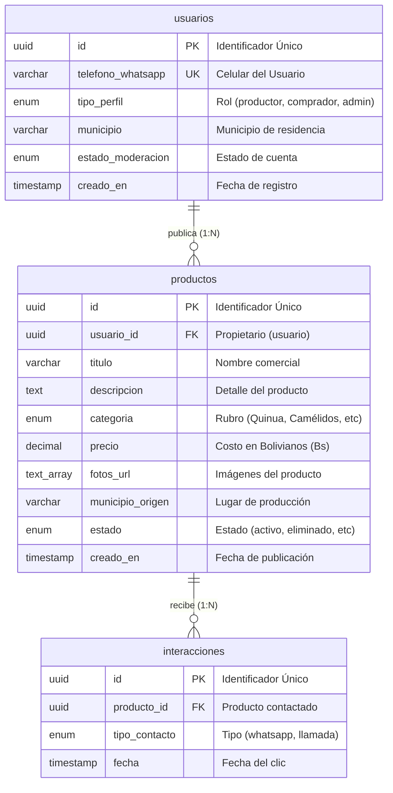

# 🗄️ Mapa de la Base de Datos - Oruro Marketplace

Este documento describe de manera exhaustiva el modelo lógico de la base de datos, detallando las tablas, columnas, tipos de datos nativos, claves, relaciones de integridad y enumeradores del sistema.

---

## 📊 Diagrama Entidad-Relación (DER)

A continuación se ilustra el flujo relacional entre los usuarios, productos e interacciones comerciales de la plataforma:

---

## 🗂️ Catálogo de Tablas y Diccionario de Datos

### 1. Tabla: `usuarios` (`usuarios` en DB)
Almacena la información de autenticación y de perfil de todos los actores del sistema.

| Nombre de Columna | Tipo Postgres | Tipo Prisma | Restricciones / Claves | Descripción |
| :--- | :--- | :--- | :--- | :--- |
| `id` | `uuid` | `String` | `PRIMARY KEY`, Autogenerado v4 | Identificador del usuario. |
| `telefono_whatsapp` | `varchar(20)` | `String` | `UNIQUE`, `NOT NULL` | Teléfono internacional de WhatsApp (ej. 59171234567). |
| `tipo_perfil` | `varchar(20)` | `Enum: Perfil` | `NOT NULL`, `CHECK` | Rol del usuario en el marketplace. |
| `municipio` | `varchar(50)` | `String` | `NOT NULL` | Municipio de residencia o comercialización de Oruro. |
| `estado_moderacion` | `varchar(20)` | `Enum: EstadoModeracion`| `DEFAULT 'activo'`, `CHECK` | Control de acceso administrativo. |
| `creado_en` | `timestamp` | `DateTime` | `DEFAULT CURRENT_TIMESTAMP` | Fecha de creación del registro. |

### 2. Tabla: `productos` (`productos` en DB)
Contiene las publicaciones de quinua, derivados y textiles de los productores.

| Nombre de Columna | Tipo Postgres | Tipo Prisma | Restricciones / Claves | Descripción |
| :--- | :--- | :--- | :--- | :--- |
| `id` | `uuid` | `String` | `PRIMARY KEY`, Autogenerado v4 | Identificador de la publicación. |
| `usuario_id` | `uuid` | `String` | `FOREIGN KEY` -> `usuarios(id)`, `ON DELETE CASCADE` | Productor que publicó la oferta. |
| `titulo` | `varchar(100)` | `String` | `NOT NULL` | Título llamativo de la publicación. |
| `descripcion` | `text` | `String` | `NOT NULL` | Descripción de las propiedades y stock. |
| `categoria` | `varchar(50)` | `Enum: Categoria` | `NOT NULL`, `CHECK` | Categoría principal de clasificación del producto. |
| `precio` | `numeric(10,2)` | `Decimal` | `NOT NULL`, `CHECK (precio > 0)` | Precio unitario expresado en Bolivianos (Bs). |
| `fotos_url` | `text[]` | `String[]` | `DEFAULT '{}'` | Array de enlaces de almacenamiento de las fotos. |
| `municipio_origen` | `varchar(50)` | `String` | `NOT NULL` | Municipio de Oruro donde se extrajo/creó. |
| `estado` | `varchar(20)` | `Enum: EstadoProducto`| `DEFAULT 'activo'`, `CHECK` | Estado del producto en el catálogo. |
| `creado_en` | `timestamp` | `DateTime` | `DEFAULT CURRENT_TIMESTAMP` | Fecha de creación de la oferta. |

### 3. Tabla: `interacciones` (`interacciones` en DB)
Registra las intenciones de compra (clics en contacto) para nutrir el tablero estadístico comercial de la Gobernación.

| Nombre de Columna | Tipo Postgres | Tipo Prisma | Restricciones / Claves | Descripción |
| :--- | :--- | :--- | :--- | :--- |
| `id` | `uuid` | `String` | `PRIMARY KEY`, Autogenerado v4 | Identificador de la interacción. |
| `producto_id` | `uuid` | `String` | `FOREIGN KEY` -> `productos(id)`, `ON DELETE CASCADE` | Producto sobre el cual se hizo el contacto. |
| `tipo_contacto` | `varchar(20)` | `Enum: TipoContacto` | `NOT NULL`, `CHECK` | Canal utilizado (WhatsApp o Llamada directa). |
| `fecha` | `timestamp` | `DateTime` | `DEFAULT CURRENT_TIMESTAMP` | Fecha exacta en la que se pulsó el botón. |

---

## 🏷️ Tipos Enumerados (Enums)

El sistema utiliza los siguientes enums definidos para acotar y forzar dominios válidos:

1.  **`Perfil`:** `productor`, `comprador`, `admin`
2.  **`Categoria`:** `Quinua Real`, `Camélidos`, `Textiles`, `Otros`
3.  **`EstadoModeracion`:** `activo`, `suspendido`
4.  **`EstadoProducto`:** `activo`, `eliminado`, `pendiente`
5.  **`TipoContacto`:** `clic_whatsapp`, `clic_llamada`

---

## ⚡ Reglas de Integridad y Rendimiento Relacional

*   **Integridad Referencial en Cascada:**
    Si un usuario es suspendido o da de baja su cuenta (`usuarios.id`), la base de datos realiza una eliminación física en cascada (`ON DELETE CASCADE`) de todos los registros de la tabla `productos` relacionados con dicho usuario. A su vez, todos los logs de `interacciones` de esos productos se eliminan en cascada.
*   **Optimización e Indexación:**
    Se crearon índices sobre las columnas más filtradas en el feed de la aplicación móvil y la consola administrativa:
    *   `idx_productos_municipio` y `idx_productos_categoria`: Acelera la búsqueda de productos en las provincias de Oruro.
    *   `idx_interacciones_producto` y `idx_interacciones_fecha`: Permite calcular y agrupar de forma instantánea las métricas diarias en el panel de control de la Gobernación.
