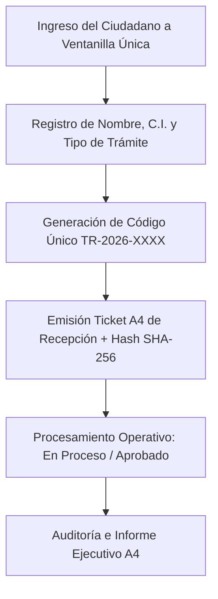

# 📋 Registro de Trámites Ciudadanos (CRUD SAFCO)

### **Gobernación Autónoma Departamental de Oruro (Bolivia)**
*Secretaría General · Ventanilla Única de Atención al Ciudadano*


[](./index.html)
[](https://www.lexivox.org/packages/lexml/mostrar_jurisprudencia.php?sx=BO-L-1178)
[](#-nota-de-confidencialidad-y-alcance-del-prototipo)

---

> [!IMPORTANT]
> ### 🔒 Nota de Confidencialidad y Alcance del Prototipo Tecnológico
> **Exactitud Operativa y Carácter Demostrativo:** Este módulo representa un **prototipo arquitectónico, modelo funcional e inducción de ingeniería de software** desarrollado para la Ventanilla Única de Atención al Ciudadano del Gobierno Autónomo Departamental de Oruro.
> 
> * **Réplica Exacta de Operaciones CRUD:** La creación de solicitudes ciudadanas, la actualización de estados (*Pendiente*, *En Proceso*, *Aprobado*), la eliminación segura y la emisión de **Tickets de Recepción A4** reproducen la gestión documental bajo la Ley N° 1178 (SAFCO).
> * **Protección de Datos e Infraestructura Segura:** Este prototipo demuestra con total claridad la precisión técnica y modularidad del sistema.

---

## 🔄 Evolución del Sistema: ¿Para qué era suficiente antes vs. En qué mejora este proyecto?

### 📂 1. ¿Para qué era suficiente la metodología tradicional?
Antes de la implementación del módulo de Registro de Trámites, la atención en ventanilla se realizaba mediante **fichas de cartulina y planillas impresas**:
* **Suficiente para tomar datos básicos:** Escribir el nombre y C.I. del solicitante en un cuaderno.
* **Suficiente para emitir recibos de papel:** Entregar un comprobante recortable.

### ⚡ 2. ¿En qué mejora sustancialmente este proyecto?
Este módulo agiliza la atención pública gubernamental:
1. **Operaciones CRUD en Tiempo Real**: Creación, lectura, actualización y eliminación dinámica de trámites ciudadanos con código único `TR-2026-XXXX`.
2. **Ticket Oficial de Recepción A4 Membretado**: Emisión e impresión de comprobantes A4 con código de seguimiento, estado del trámite, sello institucional y Hash SHA-256 de seguridad.
3. **Búsqueda e Historial Persistente**: Filtro instantáneo por número de trámite, nombre o C.I. del ciudadano.
4. **Informe Ejecutivo Consolidad de Trámites A4**: Planilla consolidada A4 para la Secretaría General.

---

## 📐 Flujo de Registro & Seguimiento (CRUD SAFCO)



---

## 🧪 Guía de Pruebas de QA e Inducción Paso a Paso

1. **Caso 1: Registro de Nueva Licencia de Funcionamiento**
   * En el formulario izquierdo, ingresa `Juan Carlos Flores`, C.I. `1234567 OR` y selecciona `Licencia de Funcionamiento`.
   * *Resultado:* Registrara el trámite `TR-2026-0004` y abrirá el **Ticket A4 Membretado SAFCO**.

2. **Caso 2: Impresión de Informe Ejecutivo A4**
   * En la barra lateral, haz clic en **Informe Ejecutivo A4**.
   * *Resultado:* Renderizará la planilla A4 consolidada de trámites registrados.

---

## 📂 Arquitectura del Módulo

```text
registro-tramites/
├── index.html                   # Dashboard CRUD de trámites, formulario y modales A4
├── REadme.md                    # Documentación técnica, flujos CRUD, diagrama Mermaid y guía QA
├── assets/
│   ├── banner.png               # Banner panorámico oficial (1000 x 300 px)
│   └── css/
│       └── styles.css           # Design Tokens (Cyber Emerald), tablas y estilos de impresión A4
└── src/
    └── main.js                  # Lógica de operaciones CRUD, persistencia local y reportes
```

---

*Gobierno Autónomo Departamental de Oruro — Ventanilla Única de Atención al Ciudadano*
