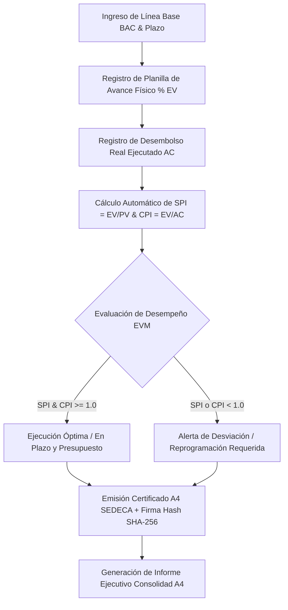

# 🚧 Monitoreo Financiero & Físico de Obras Viales (EVM)

### **Gobernación Autónoma Departamental de Oruro (Bolivia)**
*Secretaría Departamental de Obras Públicas · Servicio Departamental de Caminos (SEDECA)*


[](./index.html)
[](https://www.pmi.org)
[](https://www.lexivox.org/packages/lexml/mostrar_jurisprudencia.php?sx=BO-L-1178)

---

> [!IMPORTANT]
> ### 🔒 Nota de Confidencialidad y Alcance del Prototipo Tecnológico
> **Exactitud Operativa y Carácter Demostrativo:** Este módulo representa un **prototipo arquitectónico, modelo funcional e inducción de ingeniería de software** desarrollado para la Secretaría Departamental de Obras Públicas y el SEDECA del Gobierno Autónomo Departamental de Oruro.
> 
> * **Réplica Exacta de la Lógica de Negocio:** Las fórmulas internacionales de Gestión del Valor Ganado (*Earned Value Management - ANSI/EIA 748*): `SPI = EV / PV`, `CPI = EV / AC`, `EAC = BAC / CPI` y la emisión de **Certificados de Auditoría de Avance A4** reproducen con **estricta exactitud operativa** los flujos de fiscalización vial de Bolivia.
> * **Protección de Datos e Infraestructura Segura:** Debido a que las obras viales involucran planillas de avance, desembolsos presupuestarios SAFCO y fiscalización de contratos de obra pública confidenciales, **los sistemas definitivos de producción operan en la red gubernamental privada**. Este prototipo demuestra con total transparencia la precisión técnica y modularidad de la solución.

---

## 🔄 Evolución del Sistema: ¿Para qué era suficiente antes vs. En qué mejora este proyecto?

### 📂 1. ¿Para qué era suficiente la metodología tradicional?
Antes de la implementación de este panel de control EVM, el seguimiento de proyectos viales se basaba en **informes impresos en papel y hojas de cálculo desarticuladas**:
* **Suficiente para reportes de porcentaje simple:** Medir únicamente el porcentaje físico global informado por la empresa contratista.
* **Suficiente para revisiones mensuales:** Revisar planillas de avance financiero una vez al mes sin correlación en tiempo real entre costo ejecutado y avance de cronograma.
* **Suficiente para archivo documental:** Guardar las planillas físicas de desembolso en carpetas del SEDECA.

### ⚡ 2. ¿En qué mejora sustancialmente este proyecto?
Este módulo eleva la fiscalización departamental a estándares internacionales de ingeniería de proyectos:
1. **Control de Valor Ganado en Tiempo Real (EVM)**: Evaluación simultánea del desembolso financiero (`Actual Cost - AC`) frente al trabajo físico realmente ejecutado (`Earned Value - EV`).
2. **Índices de Desempeño Automatizados (SPI & CPI)**:
   * **SPI (Schedule Performance Index)**: Mide la eficiencia del tiempo/cronograma (`SPI = EV / PV`).
   * **CPI (Cost Performance Index)**: Mide la eficiencia del costo presupuestario (`CPI = EV / AC`).
3. **Proyección del Costo al Finalizar (EAC)**: Estimación matemática automática del costo total final de la obra (`EAC = BAC / CPI`) para anticipar sobrecostos antes de agotar la partida.
4. **Certificado de Auditoría Vial A4 Membretado**: Emisión oficial de informes de avance A4 con visto técnico, sello del SEDECA, firmas de Fiscalización y Hash SHA-256 de seguridad.
5. **Simulador EVM Interactivo**: Herramienta integrada para simular escenarios de variación de costo y plazo en proyectos viales.
6. **Informe Ejecutivo para Asambleístas y Gobernación**: Consolidado A4 con métricas clave listo para sesiones de rendición de cuentas pública.

---

## 📐 Flujo de Fiscalización Vial (EVM - ANSI/EIA 748)



---

## 📐 Fórmulas Matemáticas EVM Implementadas

$$\text{PV (Valor Planificado)} = \text{BAC} \times \frac{\% \text{Planificado}}{100}$$

$$\text{EV (Valor Ganado)} = \text{BAC} \times \frac{\% \text{Real Ejecutado}}{100}$$

$$\text{SPI (Índice Cronograma)} = \frac{\text{EV}}{\text{PV}}$$

$$\text{CPI (Índice Costo)} = \frac{\text{EV}}{\text{AC}}$$

$$\text{EAC (Estimación al Finalizar)} = \frac{\text{BAC}}{\text{CPI}}$$

---

## 🧪 Guía de Pruebas de QA e Inducción Paso a Paso

1. **Caso 1: Evaluación de Obra Vial en Óptimo Estado**
   * Revisa el proyecto `Asfaltado Tramo Oruro - Huanuni`.
   * Verifica los indicadores: `SPI: 1.05` y `CPI: 1.05` (indicador verde `Excelente`).
   * Haz clic en **Ficha A4** para abrir e imprimir el **Certificado de Avance SEDECA A4**.

2. **Caso 2: Simulación de Desviación con Calculadora EVM**
   * En la barra lateral, abre **Calculadora EVM**.
   * Ingresa `BAC: 10.000.000`, `AC: 7.000.000`, `% PV: 60%`, `% EV: 50%`.
   * *Resultado:* Calculará `SPI: 0.83` (Retraso) y `CPI: 0.71` (Sobrecosto) con la proyección `EAC: Bs. 14.000.000`.

3. **Caso 3: Generación de Informe Ejecutivo Consolidad**
   * Haz clic en **Informe Ejecutivo A4** en el menú.
   * *Resultado:* Renderizará la planilla consolidada de proyectos viales con total presupuestario en Bolivianos (Bs.).

---

## 📂 Arquitectura del Módulo

```text
seguimiento-obras/
├── index.html                   # Dashboard EVM, tabla de proyectos, calculadora y modales A4
├── README.md                    # Documentación técnica, fórmulas matemáticas EVM y guía QA
├── assets/
│   ├── banner.png               # Banner panorámico oficial (1000 x 300 px)
│   └── css/
│       └── styles.css           # Design Tokens, barras de progreso y estilos de impresión A4
└── src/
    └── main.js                  # Lógica matemática EVM (SPI, CPI, EAC), certicados A4 y simulador
```

---

*Gobierno Autónomo Departamental de Oruro — Servicio Departamental de Caminos (SEDECA)*
