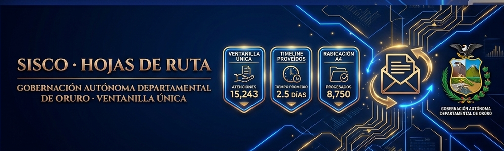
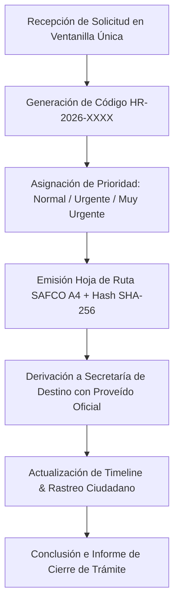

# 🏛️ SISCO — Hojas de Ruta & Correspondencia Oficial

### **Gobernación Autónoma Departamental de Oruro (Bolivia)**
*Secretaría General · Ventanilla Única de Radicación & Trazabilidad Documental*



[](./index.html)
[](https://www.lexivox.org/packages/lexml/mostrar_jurisprudencia.php?sx=BO-L-1178)
[](#-nota-de-confidencialidad-y-alcance-del-prototipo)

---

> [!IMPORTANT]
> ### 🔒 Nota de Confidencialidad y Alcance del Prototipo Tecnológico
> **Exactitud Operativa y Carácter Demostrativo:** Este módulo representa un **prototipo arquitectónico, modelo funcional e inducción de ingeniería de software** desarrollado para la Secretaría General del Gobierno Autónomo Departamental de Oruro.
> 
> * **Réplica Exacta de la Lógica de Negocio:** La radicación en Ventanilla Única, la derivación interinstitucional de solicitudes entre secretarías, la matriz de proveídos oficiales y la impresión de **Hojas de Ruta SAFCO A4** reproducen con **estricta exactitud operativa** la Ley N° 1178 de Administración y Control Gubernamentales.
> * **Protección de Datos e Infraestructura Segura:** Debido a que la correspondencia oficial contiene datos personales y de interés institucional, **los sistemas definitivos de producción operan en redes de intranet gubernamental protegidas**. Este prototipo demuestra con total claridad la precisión técnica y modularidad del sistema.

---

## 🔄 Evolución del Sistema: ¿Para qué era suficiente antes vs. En qué mejora este proyecto?

### 📂 1. ¿Para qué era suficiente la metodología tradicional?
Antes de la implementación de SISCO, la correspondencia gubernamental se administraba con **libros de registro físicos en papel y sellos manuales**:
* **Suficiente para sellar recepción:** Timbrar un sello de recepción con hora y fecha en la copia del ciudadano.
* **Suficiente para archivo en archivadores fisicos:** Guardar carpetas en estantes por orden de fecha.
* **Suficiente para derivación manual:** Entregar físicamente notas de una oficina a otra mediante mensajeros.

### ⚡ 2. ¿En qué mejora sustancialmente este proyecto?
Este módulo digitaliza y transparenta la trazabilidad documental:
1. **Radicación Digital en Ventanilla Única**: Generación instantánea del código `HR-2026-XXXX` con registro de remitente, C.I. y prioridad operativa (*Normal*, *Urgente*, *Muy Urgente*).
2. **Timeline de Proveídos y Derivación en Vivo**: Historial cronológico que audita cada traspaso entre Secretarías (*Ventanilla Única ➔ Secretaría General ➔ SEDECA ➔ Economía*).
3. **Hoja de Ruta A4 Membretada SAFCO**: Emisión oficial del documento de Hoja de Ruta A4 con matriz de proveídos para firmas y sellos institucionales.
4. **Rastreo Ciudadano de Trámites**: Herramienta de consulta instantánea para que el usuario conozca la ubicación exacta de su trámite con su código `HR-2026-XXXX`.
5. **Reportes Ejecutivos A4**: Consolidado de correspondencia tramitada para la Secretaría General.

---

## 📐 Flujo de Derivación Documental (SISCO)



---

## 🧪 Guía de Pruebas de QA e Inducción Paso a Paso

1. **Caso 1: Radicación de Nueva Hoja de Ruta Externa**
   * En la pestaña **Ventanilla Única**, ingresa Remitente `Juan Pérez`, C.I. `4581298 OR`, Asunto `Solicitud de asfaltado Caracollo - La Joya`, Destino `Secretaría de Obras Públicas (SEDECA)`.
   * *Resultado:* Generará la `HR-2026-0004` y abrirá la **Hoja de Ruta A4 SAFCO**.

2. **Caso 2: Derivación entre Secretarías**
   * Pasa a la pestaña **Bandeja Institucional** y haz clic en **Derivar** en una fila.
   * Selecciona `Secretaría de Economía y Finanzas` e ingresa la instrucción *Proceder con certificación presupuestaria*.
   * *Resultado:* Actualizará la ubicación y añadirá el hito al timeline.

3. **Caso 3: Rastreo Ciudadano**
   * Pasa a la pestaña **Rastreo de Hoja de Ruta**, ingresa `HR-2026-0001` y presiona **Buscar**.
   * *Resultado:* Renderizará la línea de tiempo completa del trámite.

---

## 📂 Arquitectura del Módulo

```text
sistema-correspondencia/
├── index.html                   # Dashboard de correspondencia, Ventanilla Única, Bandeja y Rastreo
├── README.md                    # Documentación técnica, flujos SAFCO, diagrama Mermaid y guía QA
├── assets/
│   ├── banner.png               # Banner panorámico oficial (1000 x 300 px)
│   └── css/
│       └── styles.css           # Design Tokens (Royal Blue), tablas y estilos de impresión A4
└── src/
    └── main.js                  # Lógica de Hojas de Ruta, derivaciones, rastreo ciudadano y reportes
```

---

*Gobierno Autónomo Departamental de Oruro — Secretaría General & Ventanilla Única*
