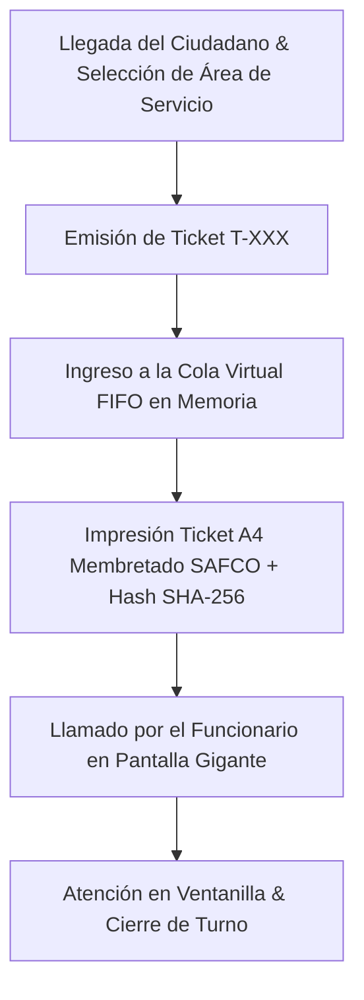

# 🎟️ Sistema de Turnos FIFO & Llamador de Ventanillas

### **Gobernación Autónoma Departamental de Oruro (Bolivia)**
*Secretaría General · Plataforma de Atención al Ciudadano*


[](./index.html)
[](#-flujo-de-atenci%C3%B3n-y-algoritmo-fifo)
[](#-nota-de-confidencialidad-y-alcance-del-prototipo)

---

> [!IMPORTANT]
> ### 🔒 Nota de Confidencialidad y Alcance del Prototipo Tecnológico
> **Exactitud Operativa y Carácter Demostrativo:** Este módulo representa un **prototipo arquitectónico, modelo funcional e inducción de ingeniería de software** desarrollado para las Salas de Atención al Público del Gobierno Autónomo Departamental de Oruro.
> 
> * **Réplica Exacta de la Lógica de Negocio:** El algoritmo de asignación secuencial en colas FIFO (*First-In, First-Out*), la llamada digital a ventanillas (Ventanilla 1: Trámites Generales, Ventanilla 2: Personerías, Ventanilla 3: Regalías Mineras) y la impresión de **Tickets de Atención A4** reproducen con estricta precisión los estándares institucionales.
> * **Protección de Datos e Infraestructura Segura:** Este prototipo demuestra con total claridad la precisión técnica y modularidad del sistema.

---

## 🔄 Evolución del Sistema: ¿Para qué era suficiente antes vs. En qué mejora este proyecto?

### 📂 1. ¿Para qué era suficiente la metodología tradicional?
Antes de la implementación de este módulo, las filas de atención ciudadana se organizaban mediante **fichas manuales impresas o desorden en ventanilla**:
* **Suficiente para repartir fichas de papel en la mañana:** Entregar cupones numerados a los primeros en llegar.
* **Suficiente para llamado a viva voz:** Gritar el número del ciudadano en la sala de espera.

### ⚡ 2. ¿En qué mejora sustancialmente este proyecto?
Este módulo organiza y agiliza la atención ciudadana:
1. **Algoritmo Estricto de Fila Virtual FIFO**: Gestión equitativa de turnos en memoria (`.shift()` y `.push()`).
2. **Llamador de Ventanillas en Pantalla Gigante**: Visualización del turno convocado (`T-101`) con aviso sonoro simulado y asignación a ventanillas específicas.
3. **Ticket de Atención A4 Membretado SAFCO**: Emisión e impresión oficial de tickets con número de turno, área de servicio, hora de emisión y Hash SHA-256 de seguridad.
4. **Informe Ejecutivo A4 de Tiempos de Atención**: Consolidado de turnos procesados en el día para la administración pública.

---

## 📐 Flujo de Atención y Algoritmo FIFO



---

## 🧪 Guía de Pruebas de QA e Inducción Paso a Paso

1. **Caso 1: Emisión de Ticket de Atención**
   * En el formulario de emisión, ingresa `Juan Pérez` y selecciona `Ventanilla 1 - Trámites Generales`.
   * *Resultado:* Emitirá el turno `T-104`, lo colocará en la fila de espera y abrirá el **Ticket A4 Membretado SAFCO**.

2. **Caso 2: Llamado del Siguiente Turno en Ventanilla**
   * En el panel central, haz clic en **🔔 Llamar Siguiente Turno**.
   * *Resultado:* Extraerá el primer turno de la cola FIFO (`T-101`), lo mostrará en letras gigantes y enviará un toast de aviso.

---

## 📂 Arquitectura del Módulo

```text
sistema-turnos/
├── index.html                   # Dashboard de atención, emisor de tickets, llamador y modales A4
├── REadme.md                    # Documentación técnica, algoritmo FIFO, diagrama Mermaid y guía QA
├── assets/
│   ├── banner.png               # Banner panorámico oficial (1000 x 300 px)
│   └── css/
│       └── styles.css           # Design Tokens (Neon Gold), contadores y estilos de impresión A4
└── src/
    └── main.js                  # Lógica de colas FIFO, llamador de ventanilla y reportes
```

---

*Gobierno Autónomo Departamental de Oruro — Dirección de Atención al Ciudadano*